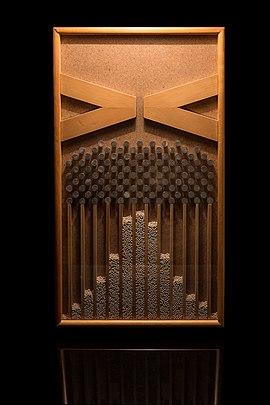
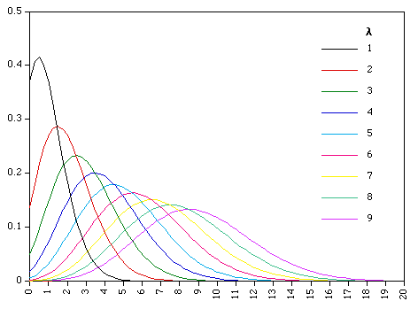

# Observed vs Expected

.pull-left[
* Comparing what we observe in the real world against what we might expect is fundamental to most spatial (and other sorts of) analyses. 

* If what we observe differs in some significant way from what we might expect, then there might be something interesting going on

* But how do we know what is expected?

  * We should expect randomness

  * Randomness conforms to known probability distributions
]

.pull-right[

* quincunx or bean machine (or Galton box) = normal distribution 


```{r echo=FALSE, out.width='45%', fig.align='center'}

```

.small[Source:[Wikipedia](https://en.wikipedia.org/wiki/Galton_board)
]  

.small[Francis Galton coined the term eugenics and endowed UCL with his personal collection and archive along with a bequest for the country’s first professorial Chair of Eugenics. Karl Pearson was the first holder of this chair. UCL recently demaned all spaces associated with Pearson and Galton]

]

???

Living in the real world will have known probability distribution  

Taking our points and comparing something random with real life distribution

If there is a difference then there is something going on...

Get the normal distirubtion everytime

---

class: inverse, center, middle

# look familiar? 

```{r echo=FALSE, out.width='100%', fig.align='center'}
knitr::include_graphics('img/thewall.jpg')
```

.small[Source:[BBC](https://www.bbc.co.uk/programmes/p07bvx36)
]  

---

# Point Pattern Anaysis

### The core question..

> ### Are these points distributed in a random way or is there some sort of pattern (uniform or clustered)?

.pull-left[

* The **expected random model** is known as Complete Spatial Randomness (CSR) 

* A random distribution of points is said to have a Poisson distribution

* By comparing the distribution of observed points with a CSR Poisson model, we can tell if we have an interesting point distribution….

]

.pull-right[


```{r echo=FALSE, out.width='75%', fig.align='center'}
knitr::include_graphics('img/Point_pattern.PNG')
```

.small[Source:[Wikipedia](https://en.wikipedia.org/wiki/Point_pattern_analysis#/media/File:Point_pattern.png)
]  
]

???

Compare all observations to complete spatial randomness - distribution of points that conforms to the Poisson distribution 

Comparing our observations to an idealized distribution of points - is it random or not?

---
# The Poisson Distribution

.pull-left[
* Describes the probability or rate of an event happening over a fixed interval of time or space

* Where the total number of events in a fixed unit is small (e.g. Breweries in a London Borough), then the probability of getting a low rate is higher

* As number of events increases, the mean (`λ` – lambda) increases and the probability distribution changes
]

.pull-right[
```{r echo=FALSE, out.width='75%', fig.align='center'}

```
.small[Source:[UMAS](https://www.pinterest.co.uk/pin/89368373833174553/)
]  

```{r echo=FALSE, out.width='75%', fig.align='center'}
knitr::include_graphics('img/breweries.png')
```
.small[Source:[Adam Dennett](https://twitter.com/adam_dennett)
]
]

???

Poisson distribution will tell us the probability of rate of event happening over fixed interval of space

Breweries in London around 2017 - what the probability of finding a brewery is in a borough, based on the average occurrence  in London

---

# The Poisson Distribution 2


---

# The Poisson Distribution 3

### Rules

* The events are discrete and can be counted in integers
* Events are independent of each other
* The average number of events over space or time is known


---
# Xaringan 

* `r emo::ji("speak")` Xaringan = shar-in-gen or [ʃæ.ˈriŋ.gæn]..

* Created by Yihui Xie....also created Bookdown...

* Install the package from GitHub

* You may also need the remotes package

```{r, eval=FALSE, message=FALSE}
remotes::install_github("yihui/xaringan")
```

* In RStudio: 
  * Make a new project
  * File -> New File -> R Markdown -> From Template -> Ninja Presentation
---

# Xaringan 2

* Make a new project > click Knit


---

class: inverse, center, middle
# Don't panic

---

# Start at the top

```{r, eval=FALSE}
---
title: "Presentation Ninja"
subtitle: "⚔<br/>with xaringan"
author: "Yihui Xie"
institute: "RStudio, PBC"
date: "2016/12/12 (updated: `r Sys.Date()`)"
output:
  xaringan::moon_reader:
    lib_dir: libs
    nature:
      highlightStyle: github
      highlightLines: true
      countIncrementalSlides: false
---
```
???

highlight refers to how the code shows

---

# Writing slides

There are two "types" of slide.

Each slide is separated by a ---, this denotes a new slide 

* A normal slide (like this one) is just...

```{r, eval=FALSE}
---

# Writing slides

There are two "types" of slide.

```

* An inverse slide (the ones with just words on and the blue background)...example on next slide

```{r, eval=FALSE}
---
class: inverse, center, middle

# Writing slides

There are two "types" of slide.
```

---
class: inverse, center, middle

# Writing slides

There are two "types" of slide.

---
class: inverse, center, middle

# Inverse slides are useful for breaking up slides with text and making a specific point

---

class: center, middle

# If you don't use inverse you just get a white (or other, depending on your colourscheme) background...

```{r, eval=FALSE}
class: center, middle

# If you don't use inverse you just get a white (or other, depending on your colourscheme) background...
```
---

# Slide tools

```{r, eval=FALSE}
# Slide tools

```
## Sub heading

```{r, eval=FALSE}
## Sub heading
```
### sub sub heading

```{r, eval=FALSE}
### sub sub heading
```

* Bullet point
  * Sub bullet point

```{r, eval=FALSE}
  * Bullet point
    * Sub bullet point
```
---
# Slide tools 2

1. List
1. List 2

```{r, eval=FALSE}
1. List
1. List 2 # yes, it's 1 for both, R knows it's a list.
```
--
To add a break in a slide, meaning you have to click to advance **on the specfic** slide...
--
```{r, eval=FALSE}
--
```

.pull-left[
* To have things on the left
```{r, eval=FALSE}
.pull-left[
* To have things on the left
]
```
]

.pull-right[
* To have things on the right
```{r, eval=FALSE}
.pull-right[
* To have things on the right
]
```
]

Remember then a new slide is starts with ...
```{r, eval=FALSE}
---
```

---
# Images

...it's massive!...we need to remember code chunk options.... 


---

# Images 2

Common code chunk options

* Echo = TRUE, shows code or FALSE = doesn't
* fig.align='center'
* out.width= 'x%'


.small[The Lena River, some 2,800 miles long, is one of the largest rivers in the world. Source:[ Original from NASA. Digitally enhanced by rawpixel](https://www.rawpixel.com/image/440230/free-photo-image-nasa-russia-earth)
]


---
# Images 3

* Creating hyperlinks $[the linking text](the URL)$
```{r echo=TRUE, out.width='100%', fig.align='center', eval=FALSE}
[make a link](https://www.rawpixel.com/image/440230/free-photo-image-nasa-russia-earth)
```

* You can use $.pull-left[]$ and $.pull-right[]$ with images too. 

.pull-left[


.small[The Lena River, some 2,800 miles long, is one of the largest rivers in the world. Source:[ Original from NASA. Digitally enhanced by rawpixel](https://www.rawpixel.com/image/440230/free-photo-image-nasa-russia-earth)
]
]

.pull-right[
* Some text
]

---
# Tables

```{r, message=FALSE}
library(tidyverse) #where the mpg data is stored
knitr::kable(head(mpg), format = 'html')

```
---
# Tables 2

If you need to create a table....

* write a data set in excel or Google sheets

* load that into R (not showing the code to load it)

* wrangle anything you don't want

* use the code on the previous slide to display it

---

# Citing 


---
# Live preview of slides

It can be annoying to have to click Knit every time.

The Add In "Infinite Moon Reader" from Yihui Xie generates the slides every time you save the .Rmd.

Generates the slides on the viewer tab --- bottom right of RStudio

As you scroll through the slides the viewer tab updates with the slide you are on... 

---

# Live preview of slides


.small[The Ultimate Infinite Moon Reader for xaringan Slides. Source:[ Yihui Xie ](https://yihui.org/en/2019/02/ultimate-inf-mr/)
]
---
# Use Git

.pull-left[
* Same as we saw in CASA0005

* Store your images in a folder, i use one called img

* Any additional libraries you use that are automatically loaded go into the libs folder (should be automatically created)

* It will become quicker to use the shell as opposed to the RStudio git GUI...

* Commands: 
```{r echo=TRUE, eval = FALSE}
git add .

git commit -m "my commit message"

git push
```
]

.pull-right[

]
---
# Use Git 2

Remember to ignore any large files you might have...

When you initialize git a .gitignore is created...


.small[GitHub maximum file upload of 50mb. Source:[reddit r/ProgrammerHumor](https://www.reddit.com/r/ProgrammerHumor/comments/gm69za/my_girlfriend_crocheted_my_favourite_meme_as_a/)
]
---

# Hosting on GitHub

* Few ways we can do this...like CASA0005

1. `use_github()` from the `usethis` package will automatically create a repo of the same name as your RProject.

1. Or create a repository on GitHub 
  * Then use the code provided in the shell for your project that has git enabled 
  * "...or push an existing repository from the command line"
  * Let's you call the repo something other than your RProject name....
  * to do this you must **first** have commited some files to your git already. 

1. To "deploy" the presentation on GitHub pages
  * `usethis::use_github_pages(branch = "main")` OR
  * On GitHub repo > settings > Pages > select source as main > Save

---
class: inverse, center, title-slide, middle

# For the presentation it's expected all group members will contribute on Git

# Remember pushing and pulling?
  
---
# Themes 

* Xaringan can be styled using Cascading Style Sheets (CSS)

* But there are many themes within the Xaringan itself 

```{r, output=TRUE}
names(xaringan:::list_css())
```
---
# Themes 2 

```{r, eval=FALSE}
---
title: "Presentation Ninja"
subtitle: "⚔<br/>with xaringan"
author: "Yihui Xie"
institute: "RStudio, PBC"
date: "2016/12/12 (updated: `r Sys.Date()`)"
output:
  xaringan::moon_reader:
    css: [default, metropolis, metropolis-fonts] #<<
    lib_dir: libs
    nature:
      highlightStyle: github
      highlightLines: true
      countIncrementalSlides: false
---
```
---
# Add ons

[Garrick Aden-Buie](https://www.garrickadenbuie.com/) has many Xaringan extensions

They are refreshingly easy to use:

.pull-left[

[xaringanExtra](https://pkg.garrickadenbuie.com/xaringanExtra/#/)

* Search 
* Clipboard
* Tile view
* Hover over code
]

.pull-right[
[xaringanthemer](https://pkg.garrickadenbuie.com/xaringanthemer/)

`
.small[Source:[ xaringanthemer](https://pkg.garrickadenbuie.com/xaringanthemer/)
]
]
---
class: inverse, center, middle

# Keep it simple 
---
# Task

30 minutes + homework of you creating a **small** 5 slide presentation

* Select a sensor of your choice (any)
* Create a short (maximum 5 slides) presentation on the sensor in xaringan
* Things to consider
  * Who runs the sensor
  * What is the cost of the data 
  * Where to source the data
  * Resolutions (e.g. in a table)
  * Applications of the data...with an example
  * Images of the data (not required to download it)
  * An example of the data being used within academic (or policy) literature 

To start with get xaringan working.

---


