```{r setup, include=FALSE}
options(htmltools.dir.version = FALSE)
```

```{r xaringan-all, echo=FALSE}
library(countdown)
library(xaringan)
library(xaringanExtra)
library(knitr)

hook_source <- knitr::knit_hooks$get('source')
knitr::knit_hooks$set(source = function(x, options) {
  x <- stringr::str_replace(x, "^[[:blank:]]?([^*].+?)[[:blank:]]*#<<[[:blank:]]*$", "*\\1")
  hook_source(x, options)
})

xaringanExtra::use_broadcast()
xaringanExtra::use_freezeframe()
xaringanExtra::use_scribble()
#xaringanExtra::use_slide_tone()
xaringanExtra::use_search(show_icon = TRUE)
xaringanExtra::use_freezeframe()
xaringanExtra::use_clipboard()
xaringanExtra::use_tile_view()
xaringanExtra::use_panelset()
xaringanExtra::use_editable(expires = 1)
xaringanExtra::use_fit_screen()
xaringanExtra::use_extra_styles(
  hover_code_line = TRUE,         
  mute_unhighlighted_code = TRUE  
)
```

class: inverse, center, title-slide, middle

<style>
.title-slide .remark-slide-number {
  display: none;
}
</style>

```{r load_packages, message=FALSE, warning=FALSE, include=FALSE}
library(fontawesome)
```

# Spatial analysis of public health data

### Point Pattern Analysis

### 21/02/2022 (updated: `r format(Sys.time(), "%d/%m/%Y")`)
`r fa("link", fill = "white")`https://andrewmaclachlan.github.io/Spatial-analysis-of-public-health-data/#1
.pull-left[### Andy MacLachlan
`r fa("paper-plane", fill = "white")`[a.maclachlan@ucl.ac.uk](mailto:a.maclachlan@ucl.ac.uk)
`r fa("twitter", fill = "white")`[andymaclachlan](https://twitter.com/andymaclachlan)
`r fa("github", fill = "white")`[andrewmaclachlan](https://github.com/andrewmaclachlan)]

.pull-right[### Laura Sheppard
`r fa("paper-plane", fill = "white")`[laura.sheppard.20@ucl.ac.uk](mailto:laura.sheppard.20@ucl.ac.uk)
`r fa("twitter", fill = "white")`[laurahsheppard](https://twitter.com/laurahsheppard)
`r fa("github", fill = "white")`[LauraSheppard](https://github.com/LauraSheppard)]


`r fa("map-marker", fill = "white")`[Centre for Advanced Spatial Analysis, UCL](https://www.ucl.ac.uk/bartlett/casa/)

Slide acknowledgement: [Professor Adam Dennett](https://twitter.com/adam_dennett)

<a href="https://github.com/andrewmaclachlan" class="github-corner" aria-label="View source on GitHub"><svg width="80" height="80" viewBox="0 0 250 250" style="fill:#fff; color:#151513; position: absolute; top: 0; border: 0; left: 0; transform: scale(-1, 1);" aria-hidden="true"><path d="M0,0 L115,115 L130,115 L142,142 L250,250 L250,0 Z"></path><path d="M128.3,109.0 C113.8,99.7 119.0,89.6 119.0,89.6 C122.0,82.7 120.5,78.6 120.5,78.6 C119.2,72.0 123.4,76.3 123.4,76.3 C127.3,80.9 125.5,87.3 125.5,87.3 C122.9,97.6 130.6,101.9 134.4,103.2" fill="currentColor" style="transform-origin: 130px 106px;" class="octo-arm"></path><path d="M115.0,115.0 C114.9,115.1 118.7,116.5 119.8,115.4 L133.7,101.6 C136.9,99.2 139.9,98.4 142.2,98.6 C133.8,88.0 127.5,74.4 143.8,58.0 C148.5,53.4 154.0,51.2 159.7,51.0 C160.3,49.4 163.2,43.6 171.4,40.1 C171.4,40.1 176.1,42.5 178.8,56.2 C183.1,58.6 187.2,61.8 190.9,65.4 C194.5,69.0 197.7,73.2 200.1,77.6 C213.8,80.2 216.3,84.9 216.3,84.9 C212.7,93.1 206.9,96.0 205.4,96.6 C205.1,102.4 203.0,107.8 198.3,112.5 C181.9,128.9 168.3,122.5 157.7,114.1 C157.9,116.9 156.7,120.9 152.7,124.9 L141.0,136.5 C139.8,137.7 141.6,141.9 141.8,141.8 Z" fill="currentColor" class="octo-body"></path></svg></a><style>.github-corner:hover .octo-arm{animation:octocat-wave 560ms ease-in-out}@keyframes octocat-wave{0%,100%{transform:rotate(0)}20%,60%{transform:rotate(-25deg)}40%,80%{transform:rotate(10deg)}}@media (max-width:500px){.github-corner:hover .octo-arm{animation:none}.github-corner .octo-arm{animation:octocat-wave 560ms ease-in-out}}</style>

---
```{r xaringan-logo, echo=FALSE}
xaringanExtra::use_logo(
  image_url = "img/casa_logo.jpg"
)
```

# About me

* Undergraduate in human geography, University of Sheffield + year abroad at the University of Wollongong

* MSc in Remote Sensing and GIS, University of Southampton 

* PhD in Geography and Environmental Science, University of Southampton / University of Western Australia "Earth Observation for Quantifying Urban Growth and its Application to Sustainable City Development"

* Teaching Fellow and now lecturer in The Barlett Centre for Advanced Spatial Analysis + lead our MSc in Smart Cities and Urban Analytics becoming Urban Spatial Science

* [Research:](https://scholar.google.com/citations?user=wLrJwyQAAAAJ&hl=en)
  * Geospatial tools / data for sustainable planning and environmental decision making 
  
* Teaching:
  * [Geographic Information Systems and Science](https://andrewmaclachlan.github.io/CASA0005repo/)
  * [Remotely Sensing Cities and Environments](https://andrewmaclachlan.github.io/CASA0023/)  
---

# About Laura

* Undergraduate degree in Geography with Quantitative Research Methods, University of Bristol
* Master’s degree in Advanced Quantitative Methods, University of Bristol
* PhD degree (started in September 2020) in Advanced Spatial Analysis at CASA, UCL

Research:
* PhD is on Gendering the Research Pipeline and Diversifying Doctoral Education – includes gender and higher educational inequalities using data science and machine learning (validation, ensemble models, gender inferencing algorithms, text & pdf analysis, multilevel modelling, mapping, visualisations etc.)

Teaching:
* Taught on Geographic Information Systems and Science module in CASA for the last two years 
* Associate Fellow of Higher Education Academy


---

# How to use the lectures

- Slides are made with [xaringan](https://slides.yihui.org/xaringan/#1) `r emo::ji("speak")` shar-in-gen or [ʃæ.ˈriŋ.gæn]

- `r fa("search")` In the bottom left there is a search tool which will search all content of presentation (Control + F will also search)

- Press enter to move to the next result 

- `r fa("pencil-alt")` In the top right let's you draw on the slides, although these aren't saved.

- Pressing the letter `o` (for overview) will allow you to see an overview of the whole presentation and go to a slide

- Alternatively just typing the slide number e.g. 10 on the website will take you to that slide

- Pressing alt+F will fit the slide to the screen, this is useful if you have resized the window and have another open - side by side. 

- Pressing h will show the help 

---

class: inverse, center, middle

# Slide and content acknowledgement: [Professor Adam Dennett](https://twitter.com/adam_dennett)

---
# Outline

.pull-left[
* The importance of pattern

* Patterns of categorical point data – Point Pattern Analysis
  * Quadrat Analysis
  * Ripley’s K
  * DBSCAN

* Patterns of spatially referenced continuous observations
  * Spatial autocorrelation
  * Defining near and distant things
  * Measuring spatial autocorrelation
    * Moran’s I
    * LISA (Local indicators of spatial association)

]

.pull-right[

```{r echo=FALSE, out.width='100%'}

```

.small[Broad street pump and John Snow pub. Source:[Hartford Courant](https://www.tribpub.com/gdpr/courant.com/)
]
]
???

Two halves: 

* Rapid overview of point pattern analysis
* Detecting spatial patterns - where are they
* Point data (or categorical data in space - lines / polygons)

* Spatially referenced observations - where regions of a map are similar = clustering of values = spatial autocorrelation. 

* Methods to detect if these patterns are there or not - it might just be use seeing them
---
# Questions we can ask / set

## Points

Are these points distributed in a random way or is there some sort of pattern (uniform or clustered)?

## Spatially continuous observations (e.g. values of polygons)

How (dis)similar are our values assigned to geographic units across geographic space

---
# The first (?) point pattern analysis 

### Dr John Snow

.pull-left[

```{r echo=FALSE, out.width='60%', fig.align='center'}

```

.small[Jon Snow. Source: [Wikipedia](https://en.wikipedia.org/wiki/Jon_Snow_(character)
]
]

--

.pull-right[

```{r echo=FALSE, out.width='60%', fig.align='center'}
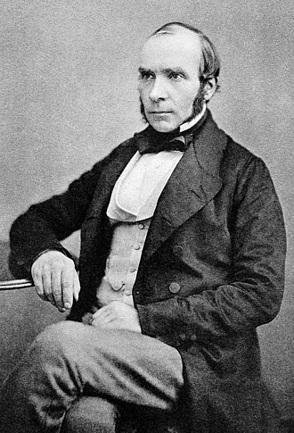
```

.small[John Snow. Source:[Wikipedia](https://en.wikipedia.org/wiki/John_Snow)
]
]

???

John snow often attributed with identifying the outbreak at the broad street pump
Data was from mortality reports issued by the Registrar General Office not surveys
Snow wasn't responsible directly, but it contributed to the knowledge 
Snow also didn't event this mapping style - 1798 New York outbreak of Yellow fever - Valentine Seaman 
Second version of the map in 1855 had distance to pump - first voroni diagram 
---

# What patterns show

```{r echo=FALSE, out.width='60%', fig.align='center'}
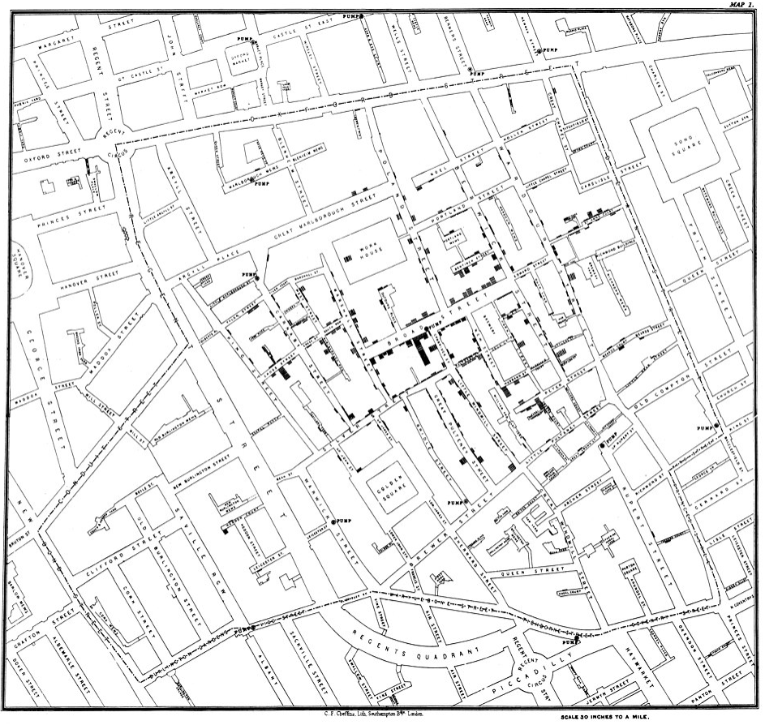
```

.small[Something in the water: the mythology of Snow’s map of cholera. Source:[Kenneth Field](https://www.esri.com/arcgis-blog/products/arcgis-pro/mapping/something-in-the-water-the-mythology-of-snows-map-of-cholera/)
]

---

# Spatial Epidemiology: Lung Cancer


```{r echo=FALSE, out.width='60%', fig.align='center'}
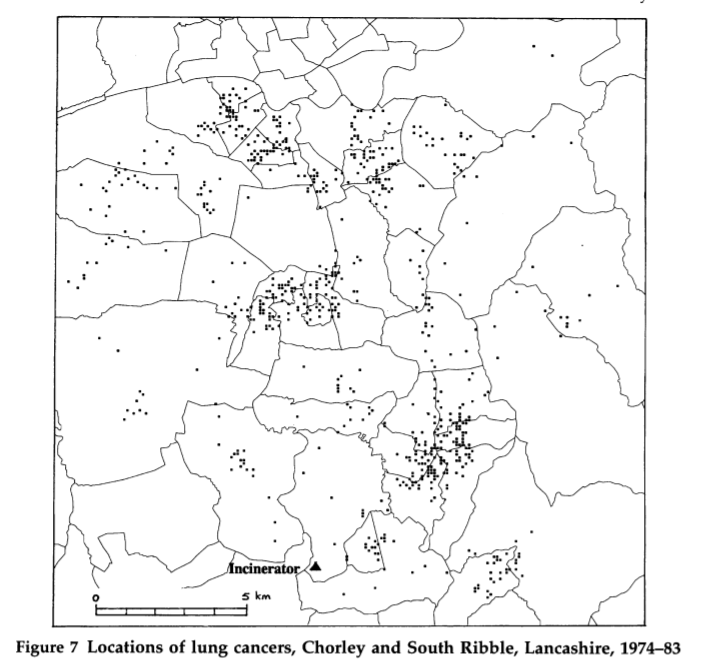
```

.small[Spatial Point Pattern Analysis and its Application in Geographical Epidemiology. Source:[Gatrell et al.1996](https://www.jstor.org/stable/622936?seq=1#metadata_info_tab_contents)
]

???

* Similar methods that we will use today - incidences of lung cancer relative to the physical envrionment - are they clustered and where? ...leads to why
* are the locations of lung cancer similar?
* Does the incinerator have any influence ?
---

# Spatial Epidemiology: Mortality

* Similar values might suggest there is something more going on
* Some sort of spatial influence
* Note the difference between spatially continuous and point data

```{r echo=FALSE, out.width='60%', fig.align='center'}
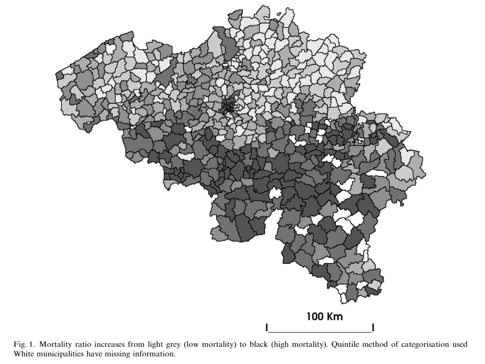
```

.small[Deprivation and mortality: the implications of spatial autocorrelation for health resources allocation. Source:[Lornt et al.2001](https://reader.elsevier.com/reader/sd/pii/S0277953600004561?token=C5F23C3B005AE5E609482CE25240CBDC867C3A88C5D3E6DFA680F5DCA353B6799D0BD26BFDA6BE8E1A55E70684613D8E&originRegion=eu-west-1&originCreation=20220221114112)
]

???

Mortality and deprivation - clear mortality areas - what else is happening here?

---

# Quantifying Spatial Patterns

What is fixed?

.pull-left[

### Point Pattern Analysis

* Properties are fixed (e.g. binary - present or not)
* Discrete objects - present or not, binary, yes or no.
* Examples: fly tipping, stop and search, blue plaques, pharmacies 

Properties fixed, but **space (location - x,y)** can vary

]

.pull-right[

### Spatial Autocorrelation

* Space (e.g. the location of the spatial units - wards, boroughs etc) is fixed
* The values of the spatial units vary
* Where the values are similar we say they exhibit Spatial Autocorrelation 

Space is fixed, but **properties (values)** can vary

]

???

Properties - the location of the point is fixed - there or not, binary
Space fixed - the spatial units fixed - boundary but properties (values) vary. 
---

# Examples

* Location of blue plaques in London
* Question: Are the points clustered or are they random?

```{r echo=FALSE, out.width='60%', fig.align='center'}
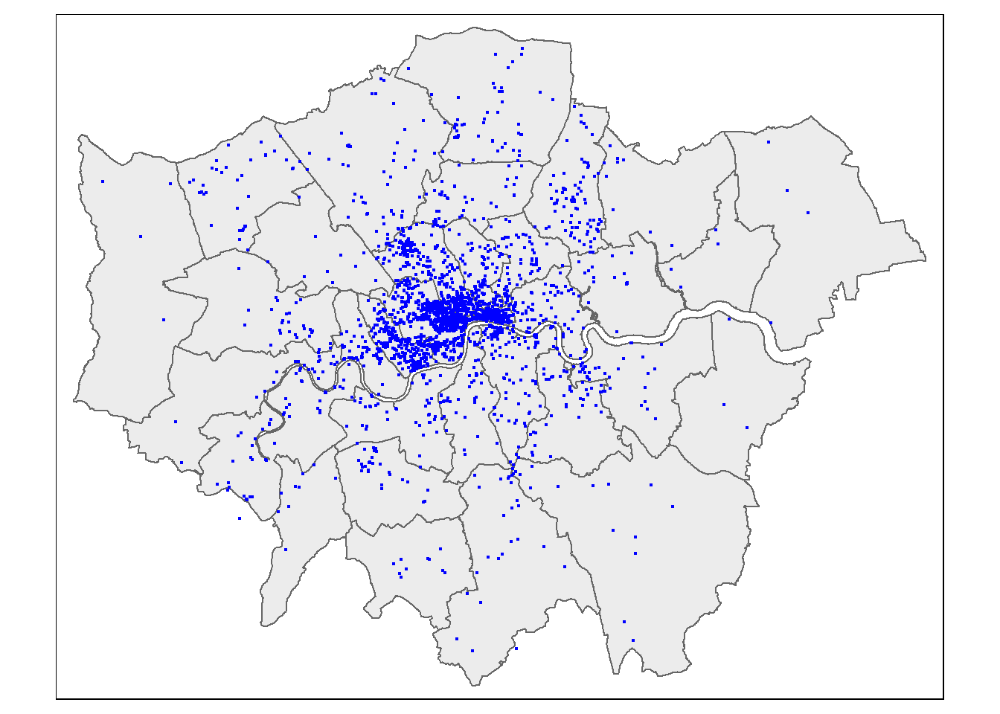
```

.small[Source:[CASA0005](https://andrewmaclachlan.github.io/CASA0005repo/detecting-spatial-patterns.html#)
]

---

# Examples

* Average GCSE point score 2014 per London ward
* Question: Are the values similar between certain wards?

```{r echo=FALSE, out.width='60%', fig.align='center'}
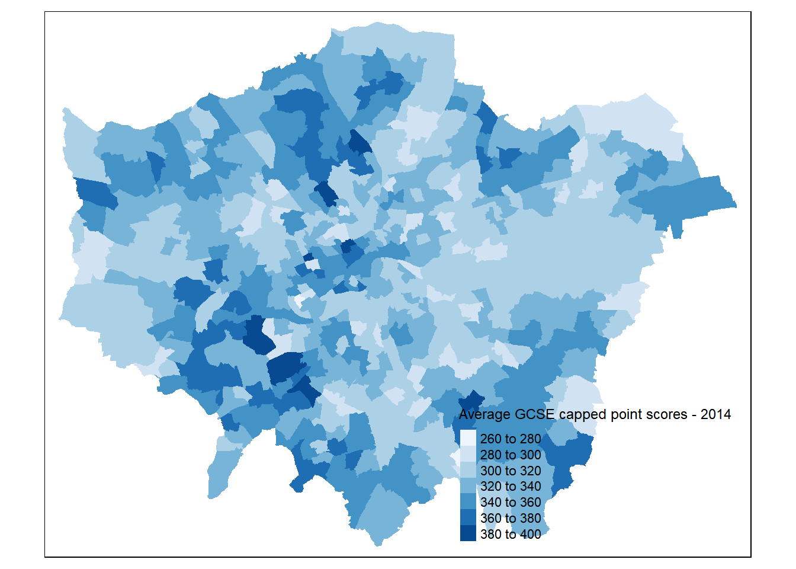
```

.small[Source:[CASA0005](https://andrewmaclachlan.github.io/CASA0005repo/detecting-spatial-patterns.html#)
]

---
# From points to spatially continuous observations 1

* We can convert almost any point data into spatially continuous observations

### Questions
* Why should we never (or almost never) use count data (e.g. number of blue plaques per ward) for spatial autocorrelation measures?

* In what instance might we be able to use count data?

* Discuss in groups for 1 min 30 seconds?

`r countdown(minutes=1, seconds =30, warn_when = 10, bottom=0, left="65%")`

---
# From points to spatially continuous observations 2

### Answers

* Summing the counts generates results that are dependent on the size of the spatial unit ...e.g...

```{r echo=FALSE, out.width='60%', fig.align='center'}
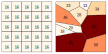
```

.small[Count of individuals in each zonal unit. Note how an underlying point distribution can generate vastly different looking choropleth maps given different aggregation schemes. Source:[Intro to GIS and Spatial Analysis Manuel Gimond, 2022](https://mgimond.github.io/Spatial/pitfalls-to-avoid.html)]

---
# From points to spatially continuous observations 3

* In this case we could sum our counts and normalise then based on some sort of underling data - such as population. e.g...lung cancer rates or mortality rates 

Our code would look similar to this ...

```{r, eval=FALSE}
points_sf_joined <- LondonWardsMerged%>%
  st_join(BluePlaquesSub)%>%
  add_count(ward_name)%>%
  janitor::clean_names()%>%
  #calculate area
  mutate(area=st_area(.))%>%
  #then density of the points per ward
  mutate(density=n/area)%>%
  #select density and some other variables 
  dplyr::select(density, ward_name, gss_code, n, average_gcse_capped_point_scores_2014)
```

* Sometimes we can have "unstable rates" - where values are very small, consult [Coping with Unstable Rates](Gimond, 2022)

---

# Small pause for code questions

I've assumed the following:

* You have some familiarity with:
  * [R](https://andrewmaclachlan.github.io/CASA0005repo/introduction-to-r.html) 
  * [Tidyverse](https://andrewmaclachlan.github.io/CASA0005repo/introduction-to-r.html#reading-data-into-r)
  * [Spatial features (sf)](https://andrewmaclachlan.github.io/CASA0005repo/introduction-to-r.html#background-to-spatial-data-in-r)
  * [Coordinate reference systems (e.g. geographic and projected)](https://andrewmaclachlan.github.io/CASA0005repo/spatial-descriptive-statistics.html#part-1-projections)

Usually i'd gauge this now and adjust what we talk about...but Laura can pause here and address any questions...

The lecture is primarily for the theory and the practical will go over the code. 
---
# From points to spatially continuous observations 4

### Answers

* An instance where it is ok to use counts is where the mapping units are spatially consistent --e.g. hexagons or Uber's H3 grid
* The variable spatial unit is removed

```{r echo=FALSE, out.width='60%', fig.align='center'}
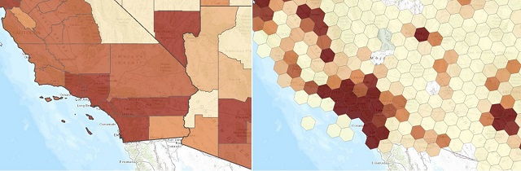
```

.small[Source:[Thematic Mapping with Hexagons, ESRI 2015](https://www.esri.com/about/newsroom/insider/thematic-mapping-with-hexagons/)
]

---
# Take care! 

### Modifiable Areal Unit Problem

* Different aggregations will lead to:

  * Different outcomes
  
  * Uncomparable results 
  
```{r echo=FALSE, out.width='60%', fig.align='center'}
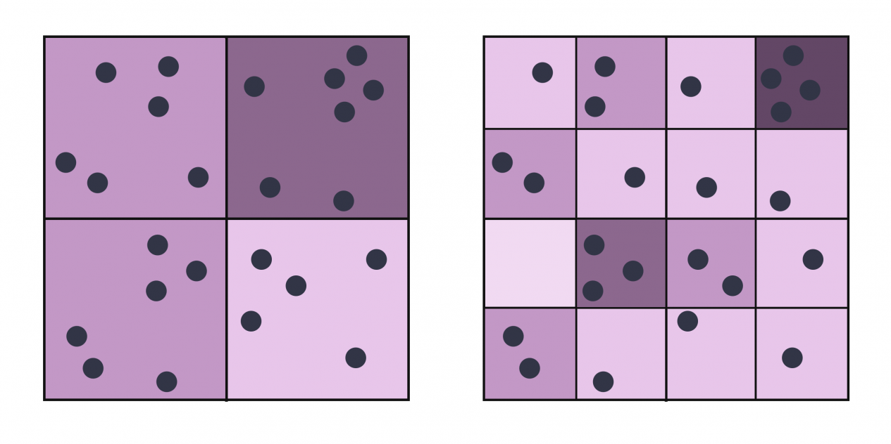
```

.small[Source:[gisgeography](https://gisgeography.com/maup-modifiable-areal-unit-problem/)
]  
---
# Take care 2! 

If you have aggregated point data they can no longer be described as points...as [Gimond 2022 says](https://mgimond.github.io/Spatial/pitfalls-to-avoid.html#ecological-fallacy)

> "you might be tempted to state that there is a strong relationship between variables v1 and v2 at the individual level. But doing so leads to the ecological fallacy where the statistical relationship at one level of aggregation is (wrongly) assumed to hold at any other levels of aggregation (including at the individual level). In fact, all you can really say is that “at this level of aggregation, we observe a strong relationship between v1 and v2” and nothing more!"  

---

class: inverse, center, middle
# Now how do we calculate clustering and spatial autocorrelation...

---

# Observed vs Expected

.pull-left[
* Comparing what we observe in the real world against what we might expect is fundamental to most spatial (and other sorts of) analyses. 

* If what we observe differs in some significant way from what we might expect, then there might be something interesting going on

* But how do we know what is expected?

  * We should expect randomness

  * Randomness conforms to known probability distributions
]

.pull-right[

* quincunx or bean machine (or Galton box) = normal distribution 


```{r echo=FALSE, out.width='45%', fig.align='center'}
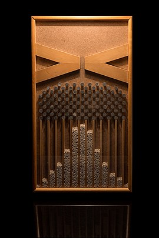
```

.small[Source:[Wikipedia](https://en.wikipedia.org/wiki/Galton_board)
]  

.small[Francis Galton coined the term eugenics and endowed UCL with his personal collection and archive along with a bequest for the country’s first professorial Chair of Eugenics. Karl Pearson was the first holder of this chair. UCL recently demaned all spaces associated with Pearson and Galton]

]

???

Living in the real world will have known probability distribution  

Taking our points and comparing something random with real life distribution

If there is a difference then there is something going on...

Get the normal distribution every time - weight machine at a gym 


---

class: inverse, center, middle

# look familiar? 

```{r echo=FALSE, out.width='100%', fig.align='center'}

```

.small[Source:[BBC](https://www.bbc.co.uk/programmes/p07bvx36)
]  

---

# Point Pattern Anaysis

### The core question..

> ### Are these points distributed in a random way or is there some sort of pattern (uniform or clustered)?

.pull-left[

* The **expected random model** is known as Complete Spatial Randomness (CSR) 

* A random distribution of points is said to have a Poisson distribution

* By comparing the distribution of observed points with a CSR Poisson model, we can tell if we have an interesting point distribution….

]

.pull-right[


```{r echo=FALSE, out.width='75%', fig.align='center'}
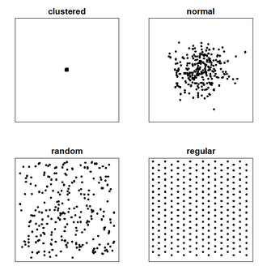
```

.small[Source:[Wikipedia](https://en.wikipedia.org/wiki/Point_pattern_analysis#/media/File:Point_pattern.png)
]  
]

???

Compare all observations to complete spatial randomness - distribution of points that conforms to the Poisson distribution 

Comparing our observations to an idealized distribution of points - is it random or not?

---
# The Poisson Distribution

.pull-left[
* Describes the probability or rate of an event happening over a fixed interval of time or space

* Where the total number of events in a fixed unit is small (e.g. Breweries in a London Borough), then the probability of getting a low rate is higher

* As number of events increases, the mean (`λ` – lambda) increases and the probability distribution changes
]

.pull-right[
```{r echo=FALSE, out.width='75%', fig.align='center'}
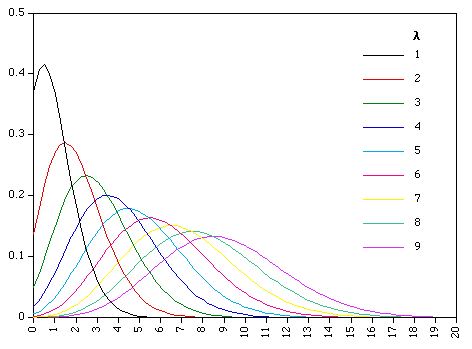
```
.small[Source:[UMAS](https://www.pinterest.co.uk/pin/89368373833174553/)
]  

```{r echo=FALSE, out.width='75%', fig.align='center'}
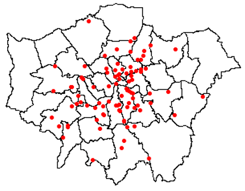
```
.small[Source:[Adam Dennett](https://twitter.com/adam_dennett)
]
]

???

Poisson distribution will tell us the probability of rate of event happening over fixed interval of space

Breweries in London around 2017 - what the probability of finding a brewery is in a borough, based on the average occurrence  in London

---

# The Poisson Distribution 2

<p align="center"><iframe width="560" height="315" src="https://www.youtube.com/embed/FdcFWP1nyRQ" title="YouTube video player" frameborder="0" allow="accelerometer; autoplay; clipboard-write; encrypted-media; gyroscope; picture-in-picture" allowfullscreen></iframe></p>

---

# The Poisson Distribution 3

### Rules / applies when 

* The events are discrete and can be counted in integers
* Events are independent of each other
* The average number of events over space (or time) is known

### Use

* It’s very useful in Point Pattern Analysis as it allows us to compare a random expected model to our observations

* Where our data **do not fit the Poisson model, then something interesting might be going on!**

* Our events might not be independent of each other – they might be clustered or dispersed and something might be causing this...

---
# Testing for CSR - Point Pattern Analysis
## Quadrat Analysis

.pull-left[

* Developed and used frequently by ecologists

* Grid of squares

* Count number of incidents (burglaries, cholera deaths, hippos etc.) in each cell – store results in a table

]

.pull-right[

```{r echo=FALSE, out.width='100%', fig.align='center'}
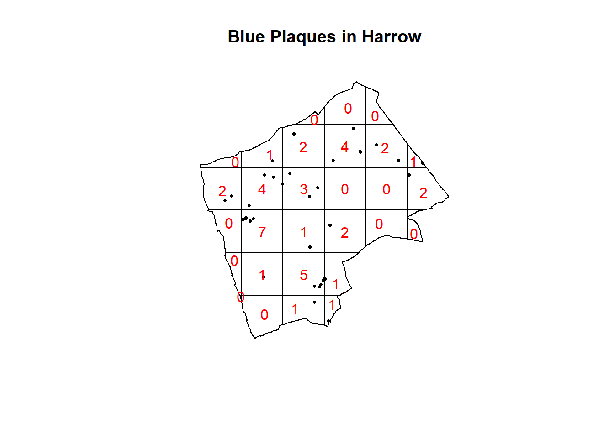
```
.small[Source:[CASA0005](https://andrewmaclachlan.github.io/CASA0005repo/detecting-spatial-patterns.html#)
]
]
.center[
 **Compare the observed occurrences with a CSR Poisson model...**
 
 Note, be careful with CSR and CRS]
 
???
 
 * Often done at school count the occurence in a square
---

# In code...

For point pattern analysis we need a point pattern (ppp) object...and an observation window...

```{r, eval=FALSE}
window <- as.owin(Harrow)

BluePlaquesSub.ppp <- ppp(x=BluePlaquesSub@coords[,1],
                          y=BluePlaquesSub@coords[,2],
                          window=window)
```

The we can create a grid...

```{r, eval=FALSE}
BluePlaquesSub.ppp %>%
  quadratcount(.,nx = 6, ny = 6)
```

Then pull out the results...

```{r, eval=FALSE}
Qcount <- BluePlaquesSub.ppp %>%
  quadratcount(.,nx = 6, ny = 6) %>%
  as.data.frame() %>%
  dplyr::count(Var1=Freq)%>%
  dplyr::rename(Freqquadratcount=n)
```

---
# Quadrat Analysis

* The (Poisson) probability (Pr) of an event (brewery in a quadrat square) is calculated ...
ex
$$Pr= (X =k) = \frac{\lambda^{k}e^{-\lambda}}{k!}$$
where:

* $x$ is the number of occurrences 

* $λ$ is the mean number of occurrences

* $e$ is a constant- 2.718

* $k!$ is the factorial of the number of occurences - remember $X=k$

---
# Plugging in the numbers
| Var1 | Freq count | Total plaques | Lambda | Probability | Expected count | Observed probability |
|------|------------|---------------|--------|-------------|----------------|----------------------|
| 0    | 12         | 0             | 1.38   | 0.3         | 7.3            | 0.4                  |
| 1    | 7          | 7             |        | 0.3         | 10.1           | 0.2                  |
| 4    | 2          | 8             |        | 0.0         | 1.1            | 0.1                  |
| 7    | 1          | 7             |        | 0.0         | 0.0            | 0.0                  |
|      | 29         | 40            |        | 1.0         | 28.9           | 1.0                  |

.pull-left[
* Var 1 = Number of values within the grids
* Freqquad = Number of grids with that value
* Total blue plaques = Var1*Frequency 
* Lambda = Total blue plaques / total frequency 
* Probability = Probability of number of plaques in quadrant ....

]

.pull-right[
 $$\frac{\lambda^{k}e^{-\lambda}}{k!}$$
* Expected = Expected frequency count on the Poisson distribution (freq count * probability)
* Observed probability = Frequency count / sum of the frequency count
]

???

* Count the number in square, then work out the mean in each given square
* Compare the observation to our expectation - and chi square will tell us if significant. 
---

class: inverse, center, middle

# Full example on [GitHub repo in the excel document](https://github.com/andrewmaclachlan/Spatial-analysis-of-public-health-data/blob/main/Poisson_example.xlsx)

---

# Confirming spatial randomness 

* We would expect the probability distribution of X (blue plaques in London) to have a Poisson distribution if they exhibit Complete Spatial Randomness...we can look at our plot...

```{r echo=FALSE, out.width='35%', fig.align='center'}
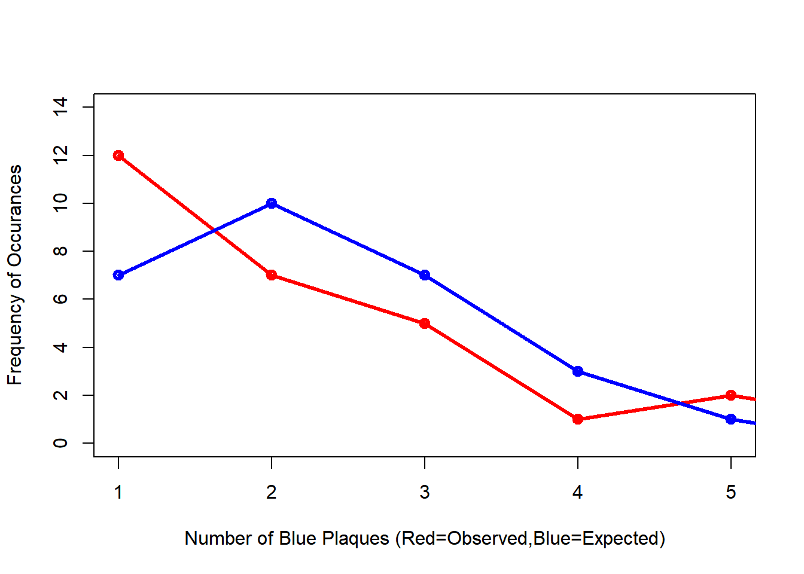
```

* We can test for CSR by comparing the observed and expected counts and using a test such as the [chi-squared](https://edge.sagepub.com/system/files/chapter18_1.pdf) 

* If our p-value is > 0.05 then this indicates that we have CSR and there is no pattern in our points. 

* If it is < 0.05, this indicates that we do have clustering in our points.

* Here our p-value = 0.2594, implying complete spatial randomness

---

class: inverse, center, middle

# What are the issues with quadrat analysis ?

### (small pause)

--

### Quadrat size
### Shape
### Both MAUP 
### the question isn't that helpful...
---

# Ripley's K 

.pull-left[

* To avoid scale and zoning problems associated with quadrat analysis, Ripley’s K tests for CSR for circles of varying radii around each point

 $$K(r) = \lambda^{-1} \sum{i}\sum{j}\frac{I(d_ij<r)}{n}$$

* In English: Ripley’s K value for any circle radius $r$ = the average density of points at that radius $\lambda = (n/ \Pi r^2))$

* Multiplied by the sum of the distances $d_ij$ between all points within that search radius

* Divided by the total number of points, n

* I = 1 or 0 depending if $d_ij < r$

]

.pull-right[
```{r echo=FALSE, out.width='100%', fig.align='center'}
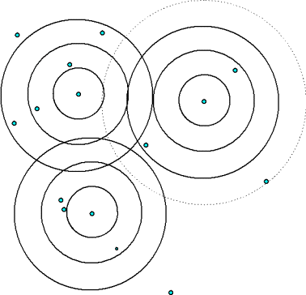
```
]

???

* Deals with the issue of square quadrants
* Analysis on the whole space

---
# Ripley's K is simply...

.pull-left[

```{r, eval=FALSE}
K <- BluePlaquesSub.ppp %>%
  Kest(., correction="border") %>%
  plot()
```

* The correction specifies how points towards the edge are dealt with

* Border means that points towards the edge are ignored for the calculation but are included for the central points

* In R type `?kest` into the console for more info 
]

.pull-right[
```{r echo=FALSE, out.width='100%', fig.align='center'}
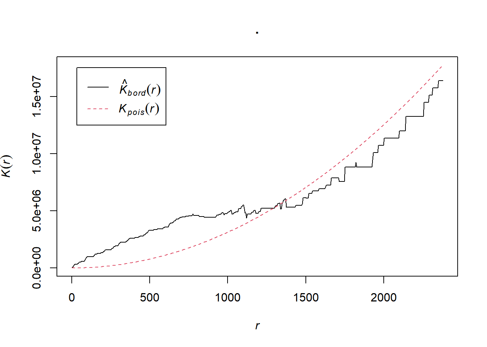
```
* Where the value of K falls above the line, the data appear to be clustered at that distance (up to 1300 metres). 

* Where the value of K is below the line, the data are dispersed
]

* But what about planning constraints? Parks? Streets? Relative or absolute clustering?


???

* Some things can't be randomly distributed - parks, planning permissions?
* Absolute or relative clustering? - the clustering of other events?

---
class: inverse, center, middle

# What are the issues with Ripley's K ?

### (small pause)

--

### Computationally intensive when there are lots of points to consider
### Extent of the study area can affect the calculation... eventually the radius around any point will include all other points in the study area
### Phenomenon being studied cannot just occur anywhere (e.g. a river) - it's not network distance but Euclidean 

---
class: inverse, center, middle

# We still don't know where are clusters are ?

---
# Density-based spatial clustering of applications with noise (DBSCAN)

.pull-left[
Popular because can detect non-linear clusters

2 parameters: 

* Epsilon (eps) = size of neighbourhood within which to search for other points

* Minimum number of points to search for (MinPts)

If a point has >= MinPts in neighbourhood then defined as ‘Core’

If point in neighbourhood of a core point but has <MinPts in its own neighbourhood, then defined as ‘Border’]

.pull-right[
```{r echo=FALSE, out.width='100%', fig.align='center'}
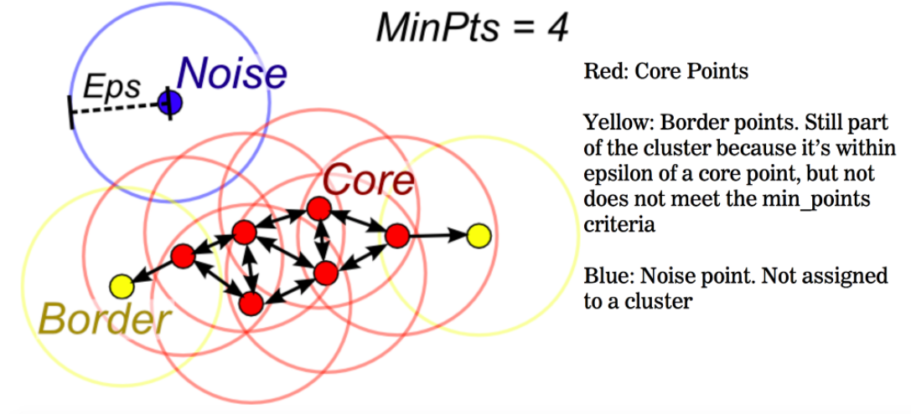
```
.small[DBSCAN. Source:[Medium](https://medium.com/@agarwalvibhor84/lets-cluster-data-points-using-dbscan-278c5459bee5/)]

```{r echo=FALSE, out.width='80%', fig.align='center'}
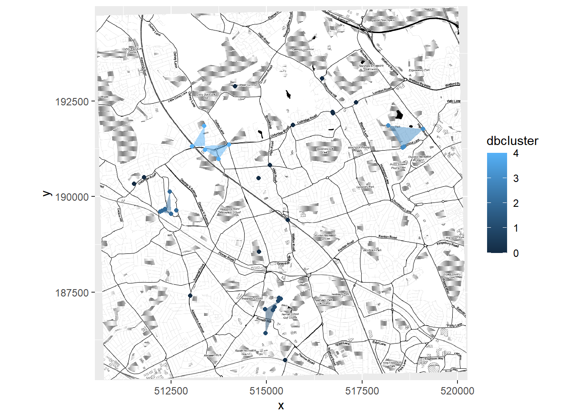
```
.small[Source:[CASA0005](https://andrewmaclachlan.github.io/CASA0005repo/detecting-spatial-patterns.html#density-based-spatial-clustering-of-applications-with-noise-dbscan)]

]

???

* If there are points within my radius then will call this a cluster 
* Define clusters of shapes and sizes - 2 values needed

---

# DBSCAN

In R DBCAN is simply...

```{r, eval=FALSE}
db <- BluePlaquesSubPoints %>%
  fpc::dbscan(.,eps = 700, MinPts = 4)
```

How to select values

* Eps: use the Ripley's K buldge - where the line shows the greatest difference to the theoretical value 

* Or plot the average  distance to the k neighbours, which are then plotted in ascending order. The knee is where this value (of distance to neighbours) increases and the value we use.

```{r, eval=FALSE}
BluePlaquesSubPoints%>%
  dbscan::kNNdistplot(.,k=4)
```

* Min points: start with what you think is appropriate 

* OPTICS - extends DBSCAN and uses an algorithm to find optimum distance thresholds for clustering. 

---
class: inverse, center, middle

# The core question..

> ### Are these points distributed in a random way or is there some sort of pattern (uniform or clustered)?

---
class: inverse, center, middle

# But... how similar is our data across geographic space?

#### sort of.. we are now considering spatially continous data (e.g. density of the points) as opposed to the points themselves...remember the quote from Gimmond 2022...

>you might be tempted to state that there is a strong relationship between variables v1 and v2 at the individual level. But doing so leads to the ecological fallacy where the statistical relationship at one level of aggregation is (wrongly) assumed to hold at any other levels of aggregation (including at the individual level). In fact, all you can really say is that “at this level of aggregation, we observe a strong relationship between v1 and v2” and nothing more!

---
class: inverse, center, middle

# Just because we have clustering doesn't mean there will be patterns of spatially referenced continuous observations 

---
# Spatially continous observations 

Tobler's First Law of Geography 

> "Everything is related to everything else, but near things are more related than distant things.”

But this does depend on our level of aggregation here...

```{r echo=FALSE, out.width='32%', fig.align='center'}
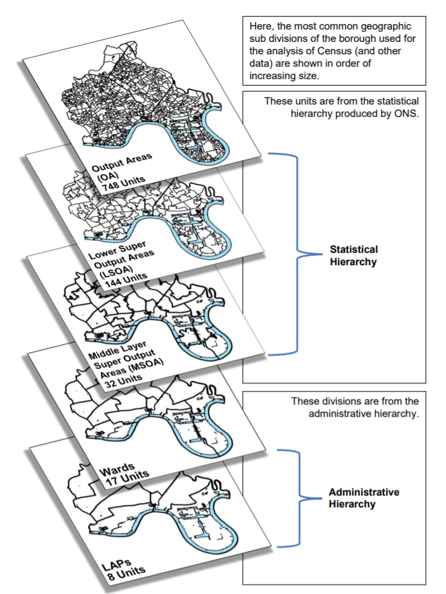
```
.small[Spatial Units. Source:[Tower Hamlets](https://www.towerhamlets.gov.uk/Documents/Borough_statistics/Research-tools-and-guidance/RB-Census2011-Census-Geography-Guide-2013-05.pdf)]

---
# Spatially continous observations 

Formal definition:

The (auto*)correlation among observations of a single variable (smoking rates, unemployment, etc.) that is strictly attributable to the proximity of those observations in geographic space.

*Auto = with itself

```{r echo=FALSE, out.width='75%', fig.align='center'}
knitr::include_graphics('img/auto_corr.png')
```

.small[Moran's I. Source:[ArcGIS](https://pro.arcgis.com/en/pro-app/2.8/tool-reference/spatial-statistics/spatial-autocorrelation.htm)
]

---
# Indices of Spatial Association

* Moran’s I, Geary’s C and Getis-Ord’s G are all indexes to compare values for neighbouring features

* Help answer the next core question – 

.center[###“are the values for neighbouring features more similar than those for all other features?”]

* If the average difference between neighbouring features is less than between all features, values are clustered.

* Can specify neighbouring based on adjacency, set distance or distance to all features – always conceived as a spatial weights matrix. 

* There are global (one number for the whole system of interest) and local (individual numbers for each zone in the system) versions of both. 

???

Are the values in near places similar or dissimilar 


---
# Moran's I

* Most popular (best?) measure of spatial autocorrelation (SA)

* Moran’s I = Do we have a clustered, random or dispersed pattern of X? 

* (Morans) I statistic is a ratio that captures **if neighbouring places have more similar values when compared with their difference to the average in the system.**

* Ranges from -1 (-ve SA) to 1 (+ve SA). 0 is no relationship.

```{r, eval=FALSE}
moran.test(., Lward.lw)
```


```{r echo=FALSE, out.width='75%', fig.align='center'}
knitr::include_graphics('img/auto_corr.png')
```

.small[Moran's I. Source:[ArcGIS](https://pro.arcgis.com/en/pro-app/2.8/tool-reference/spatial-statistics/spatial-autocorrelation.htm)
]

???

To be able to do this we need to know what boundaries each polygon shares with others - boundary relationships 

---
class: inverse, center, middle

```{r echo=FALSE, out.width='75%', fig.align='center'}
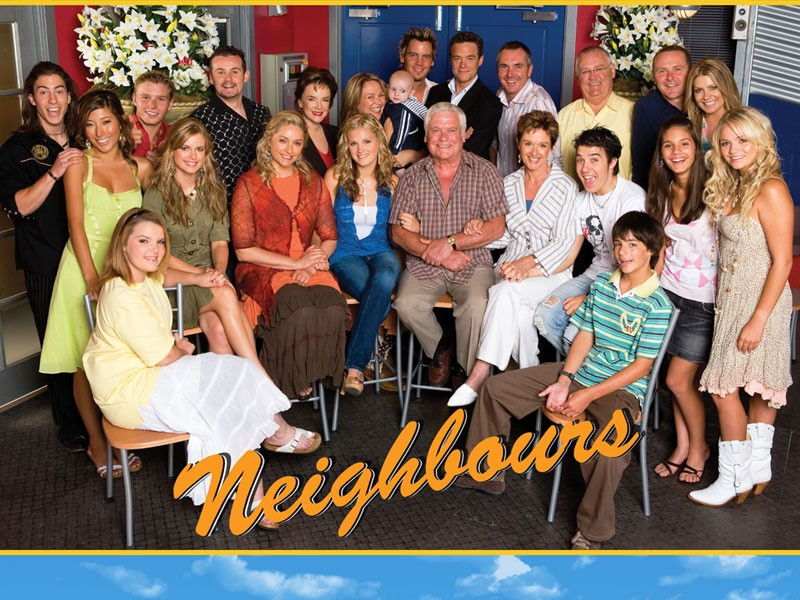
```

---

class: inverse, center, middle

# In the classroom identify who is your neighbour? 

--

### what case did you use?

```{r echo=FALSE, out.width='30%', fig.align='center'}
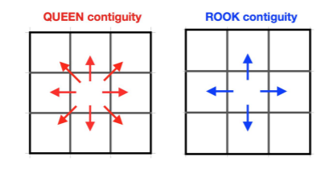
```

.small[Neighbour cases. Source:[Bellefon and Gleut, INSEE](https://www.google.com/url?sa=i&url=https%3A%2F%2Fwww.insee.fr%2Fen%2Fstatistiques%2Ffichier%2F3635545%2Fimet131-f-chapitre-2.pdf&psig=AOvVaw1LoIbkFCWaGE8yFGX33S0k&ust=1645634985794000&source=images&cd=vfe&ved=0CAwQjhxqFwoTCOj3mpvik_YCFQAAAAAdAAAAABAN)
]

```{r echo=FALSE, out.width='30%', fig.align='center'}
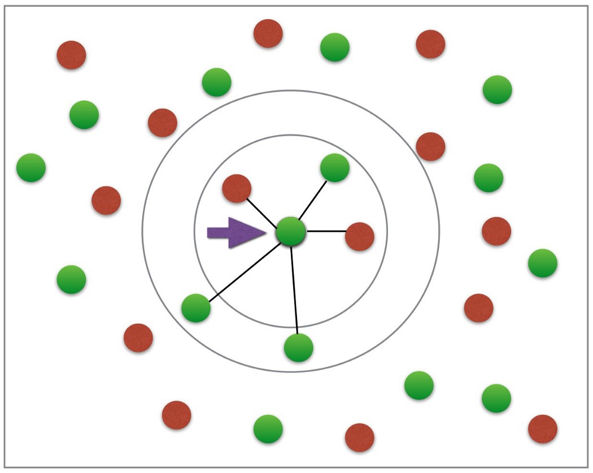
```
.small[Nearest neighbour. Source:[Towards Data Science](https://towardsdatascience.com/building-a-k-nearest-neighbors-k-nn-model-with-scikit-learn-51209555453a)
]

---

# GIS what is a neighbour

* We use the rules we have set - Rook, Queen, KNN or even just a distance for a list of neighbours 
```{r, eval=FALSE}
#create a neighbours list
LWard_nb <- points_sf_joined %>%
  poly2nb(., queen=T)
```

* We then define this in a spatial weight matrix which gives a numeric value to the neighbour.
  * B is the basic binary coding (1/0)
  * W is row standardised (sums over all links to n)
  * C is globally standardised (sums over all links to n)
  
```{r, eval=FALSE}
#create a spatial weights matrix from these weights
Lward.lw <- LWard_nb %>%
  nb2mat(., style="B")
```
---

# GIS what is a neighbour 2

```{r echo=FALSE, out.width='100%', fig.align='center'}
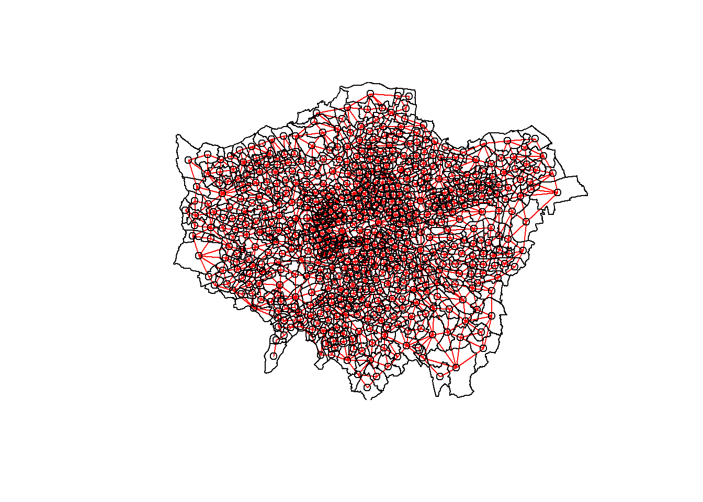
```
.small[Weight matrix. Source:[CASA0005](https://andrewmaclachlan.github.io/CASA0005repo/detecting-spatial-patterns.html#data-manipulation)
]
---

# Simple example
```{r echo=FALSE, out.width='70%', fig.align='center'}
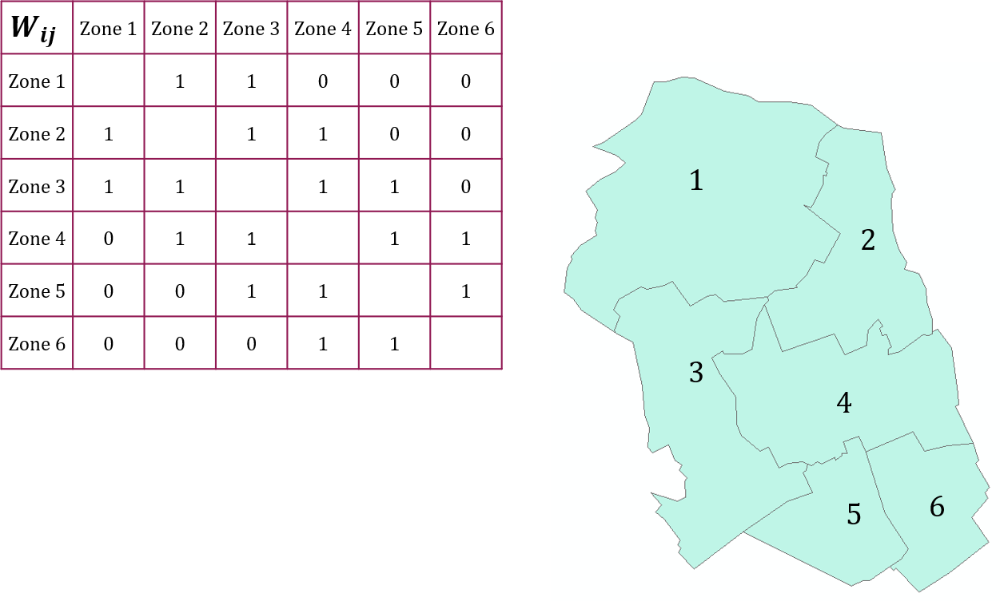
```
.small[Weight matrix. Source:[Adam Dennett](https://twitter.com/adam_dennett)
]

* In matrix algebra, it is convention to refer to **rows** with the index, $i$ and **columns** with the index, $j$
* $W_{ij}$ refers to any weight in this matrix
* $W_{13}$ =1, $W_{52}$=0 etc.

???

* W = weight
* i = row and j = column 
* Zone 1 - neighbours with zone 2 and 3, and so has a value of 1

---

# Standardisation of matrix

Standardisation **permits comparable** spatial parameters where features might be biased due to the aggregation... 

When you standardise (usually row) the fact that one unit has 20 neighbours and another 2 doesn't influence the results that much, but it would in binary. When we aggregate data the structure (e.g. polygons) aren't made for (or designed for) our point data (e.g. blue plaques, fly tipping etc). See [this ESRI help link](https://community.esri.com/t5/spatial-statistics-questions/row-standardisation-questions/td-p/440656)

Global
* Sum the weights = 18
* Divide our units by this = 6/18 
* Each weight is given 0.33

Row
* 1 is divided by the sum of the number of neighbours in each row
* In zone 1 each weight is 0.5 - Binary it would sum to 2 
* In zone 3 each weight is 0.25 - Binary it would sum to 4

---
class: inverse, center, middle


# Plugging in the numbers 


##....head to the [excel document for a Moran's I example with the formula](https://github.com/andrewmaclachlan/Spatial-analysis-of-public-health-data/blob/main/MoranI%20example.xlsx)

---
# Other measures of spatial autocorrelation 

* Geary's C
  * This tells us whether **similar values or dissimilar values are clustering**
  
  * Geary’s C falls between 0 and 2; 1 means no spatial autocorrelation, <1 - positive spatial autocorrelation or similar values clustering, >1 - negative spatial autocorreation or dissimilar values clustering) which shows that similar values are clustering

* Getis Ord General G
  * This tells us whether **high or low values are clustering**. 
  
  * If G > Expected = High values clustering; if G < expected = low values clustering

* Moran's I
  * Tells us whether we have clustered values (close to 1) or dispersed values (close to -1)


---
# Local versions (LISA) - Anselin Moran's I

.pull-left[
* Global Moran's I compares each spatial unit to the neighbours and then gives an average of all the differences identified 

* Local Moran's I `localmoran(., Lward.lw)` gives a value for each spatial unit in relation to neigbhours and ...
  * Moran's I value
  * Expected Moran's I
  * Variance
  * Z score - needs the expected and variance 
  * p-value 

* z score here allows us to state if our value is significantly difference than expected at this location considering the neighours. 

]

.pull-right[
```{r echo=FALSE, out.width='75%', fig.align='center'}
knitr::include_graphics('img/sig.png')
```
.small[What is a z score. Source:[ArcMap](https://pro.arcgis.com/en/pro-app/2.8/tool-reference/spatial-statistics/what-is-a-z-score-what-is-a-p-value.htm)
]

* Z scores = standard deviations

* High or low = unlikely that it is completely spatially random 

* We reject the null hypothesis (complete spatial randomness)

* Middle of the normal distribution is the expected outcome


.small[Global vs Local Spatial autocorrelation. Source:[story maps](https://storymaps.arcgis.com/stories/5b26f25bb81a437b89003423505e2f71)

]

]

???

LISA = Local indicators of spatial association 
---

class: inverse, center, middle

# Local versions - Anselin Moran's I

### Remember what the values mean

### Moran's I tells us whether we have clustered values (close to 1) or dispersed values (close to -1) 

### **for local this is in relation to its neighbours**...

### for global it's all values as an average

---

# Local versions - Getis-Ord Gi* 

* Pronounced G-i-star

* Similar concept but just returns a z score
  * standardised value relating to whether high values or low values are clustering together

* More intense clustering of high values = hot spot 

* More intense clustering of low values = cold spot 

```{r, eval=FALSE}
localG(., Lward.lw)
```


---
# Limitations 

* Calculating the neighbours is computationally intensive. Creates an $n^2$ matrix.

* So 10 spatial units is manageable, but 1000 requires 1,000,000 comparisons, and 10,000 100,000,000 etc. 

* This is very important as defining spatial weights matrices is crucial for running other types of analysis – spatially-lagged regression or Geographical Weighted Regression (which we will come onto in subsequent weeks)

* Global measures can mask local trends (although local versions deal with this to an extent)

* Indices of spatial association can be a good summary of the system, but it’s never possible to capture all complex spatial interactions in a single figure

---
# Summary

#### Points

* Are these points distributed in a random way or is there some sort of pattern (uniform or  clustered)?

* Point Pattern Analysis techniques all compare observed distributions of points to an expected model based on the Poisson distribution – with varying degrees of sophistication

#### Spatially continuous observations (e.g. values of polygons)

* How (dis)similar are our values assigned to geographic units across geographic space

* Analysis of the spatial autocorrelation of continuous variables over space allows us to assess if similar values cluster in space

* How we define neighbours is crucial in spatial autocorrelation analysis

---
class: inverse, center, middle

# Final task

### Consider the tools for point pattern anslysis and spatial autocorrelcation and write down what each can show...e.g...

### Moran's I shows if neighbouring places have more similar (or dissimilar) values when compared with their difference to the average in the system

### Local Moran's I shows....?

### Practical: https://rpubs.com/AndrewMacLachlan/870348

