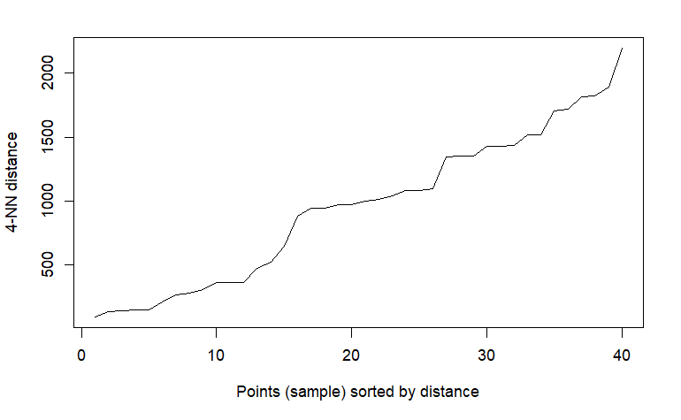
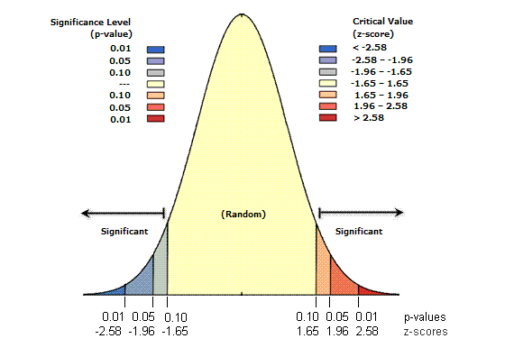

```{r setup, include=FALSE}
options(htmltools.dir.version = FALSE)
```

```{r xaringan-all, echo=FALSE}
library(countdown)
library(xaringan)
library(xaringanExtra)
library(knitr)

hook_source <- knitr::knit_hooks$get('source')
knitr::knit_hooks$set(source = function(x, options) {
  x <- stringr::str_replace(x, "^[[:blank:]]?([^*].+?)[[:blank:]]*#<<[[:blank:]]*$", "*\\1")
  hook_source(x, options)
})

xaringanExtra::use_broadcast()
xaringanExtra::use_freezeframe()
xaringanExtra::use_scribble()
#xaringanExtra::use_slide_tone()
xaringanExtra::use_search(show_icon = TRUE)
xaringanExtra::use_freezeframe()
xaringanExtra::use_clipboard()
xaringanExtra::use_tile_view()
xaringanExtra::use_panelset()
xaringanExtra::use_editable(expires = 1)
xaringanExtra::use_fit_screen()
xaringanExtra::use_extra_styles(
  hover_code_line = TRUE,         
  mute_unhighlighted_code = TRUE  
)
```

class: center, title-slide, middle

background-image: url("img/CASA_Logo_no_text_trans_17.png")
background-size: cover
background-position: center


<style>
.title-slide .remark-slide-number {
  display: none;
}
</style>

```{r load_packages, message=FALSE, warning=FALSE, include=FALSE}
library(fontawesome)
```

# Point Pattern / Spatial Autocorrelation Analysis

### 21/02/2022 (updated: `r format(Sys.time(), "%d/%m/%Y")`)
`r fa("paper-plane", fill = "#562457")`[a.maclachlan@ucl.ac.uk](mailto:a.maclachlan@ucl.ac.uk)
`r fa("twitter", fill = "#562457")`[andymaclachlan](https://twitter.com/andymaclachlan)
`r fa("github", fill = "#562457")`[andrewmaclachlan](https://github.com/andrewmaclachlan)
`r fa("location-dot", fill = "#562457")`[Centre for Advanced Spatial Analysis, UCL](https://www.ucl.ac.uk/bartlett/casa/)

<a href="https://github.com/andrewmaclachlan" class="github-corner" aria-label="View source on GitHub"><svg width="80" height="80" viewBox="0 0 250 250" style="fill:#fff; color:#151513; position: absolute; top: 0; border: 0; left: 0; transform: scale(-1, 1);" aria-hidden="true"><path d="M0,0 L115,115 L130,115 L142,142 L250,250 L250,0 Z"></path><path d="M128.3,109.0 C113.8,99.7 119.0,89.6 119.0,89.6 C122.0,82.7 120.5,78.6 120.5,78.6 C119.2,72.0 123.4,76.3 123.4,76.3 C127.3,80.9 125.5,87.3 125.5,87.3 C122.9,97.6 130.6,101.9 134.4,103.2" fill="currentColor" style="transform-origin: 130px 106px;" class="octo-arm"></path><path d="M115.0,115.0 C114.9,115.1 118.7,116.5 119.8,115.4 L133.7,101.6 C136.9,99.2 139.9,98.4 142.2,98.6 C133.8,88.0 127.5,74.4 143.8,58.0 C148.5,53.4 154.0,51.2 159.7,51.0 C160.3,49.4 163.2,43.6 171.4,40.1 C171.4,40.1 176.1,42.5 178.8,56.2 C183.1,58.6 187.2,61.8 190.9,65.4 C194.5,69.0 197.7,73.2 200.1,77.6 C213.8,80.2 216.3,84.9 216.3,84.9 C212.7,93.1 206.9,96.0 205.4,96.6 C205.1,102.4 203.0,107.8 198.3,112.5 C181.9,128.9 168.3,122.5 157.7,114.1 C157.9,116.9 156.7,120.9 152.7,124.9 L141.0,136.5 C139.8,137.7 141.6,141.9 141.8,141.8 Z" fill="currentColor" class="octo-body"></path></svg></a><style>.github-corner:hover .octo-arm{animation:octocat-wave 560ms ease-in-out}@keyframes octocat-wave{0%,100%{transform:rotate(0)}20%,60%{transform:rotate(-25deg)}40%,80%{transform:rotate(10deg)}}@media (max-width:500px){.github-corner:hover .octo-arm{animation:none}.github-corner .octo-arm{animation:octocat-wave 560ms ease-in-out}}</style>
---
```{r xaringan-logo, echo=FALSE}
xaringanExtra::use_logo(
  image_url = "img/casa_logo.jpg",
  width = "50px",
  position = xaringanExtra::css_position(top = "1em", right = "2em")

)
```

# How to use the lectures

- Slides are made with [xaringan](https://slides.yihui.org/xaringan/#1)

- `r fa("magnifying-glass")` In the bottom left there is a search tool which will search all content of presentation

- Control + F will also search 

- Press enter to move to the next result 

- `r fa("pencil")` In the top right let's you draw on the slides, although these aren't saved.

- Pressing the letter `o` (for overview) will allow you to see an overview of the whole presentation and go to a slide

- Alternatively just typing the slide number e.g. 10 on the website will take you to that slide

- Pressing alt+F will fit the slide to the screen, this is useful if you have resized the window and have another open - side by side. 


---

class: inverse, center, middle

# Slide and content acknowledgement: [Professor Adam Dennett](https://twitter.com/adam_dennett)

---
# Outline

.pull-left[
* The importance of patterns

* Patterns of categorical point data – Point Pattern Analysis
  * Quadrat Analysis
  * Ripley’s K
  * DBSCAN
  * HDBSCAN

* Patterns of spatially referenced continuous observations
  * Spatial autocorrelation
  * Defining near and distant things
  * Measuring spatial autocorrelation
    * Moran’s I
    * LISA (Local indicators of spatial association)

]

.pull-right[

```{r echo=FALSE, out.width='100%'}
knitr::include_graphics('img/pump.jpg')
```

.small[Broad street pump and John Snow pub. Source:[Hartford Courant](https://www.tribpub.com/gdpr/courant.com/)
]
]
???

Two halves: 

* Rapid overview of point pattern analysis
* Detecting spatial patterns - where are they
* Point data (or categorical data in space - lines / polygons)

* Spatially referenced observations - where regions of a map are similar = clustering of values = spatial autocorrelation. 

* Methods to detect if these patterns are there or not - it might just be use seeing them

---

class: inverse, center, middle

# Part 1: Point Pattern Analysis


---

# Questions we can ask / set

**Points**

Are these points distributed in a random way or is there some sort of pattern (uniform or clustered)?

**Spatially continuous observations (e.g. values of polygons)**

How (dis)similar are our values assigned to geographic units across geographic space

---
# The first (?) point pattern analysis 

### Dr John Snow

.pull-left[

```{r echo=FALSE, out.width='60%', fig.align='center'}
knitr::include_graphics('img/Jon_Snow_Season.png')
```

.small[Jon Snow. Source: [Wikipedia](https://en.wikipedia.org/wiki/Jon_Snow_(character)
]
]

--


.pull-right[

```{r echo=FALSE, out.width='60%', fig.align='center'}

```

.small[John Snow 1813-1858. Source:[Wikipedia](https://en.wikipedia.org/wiki/John_Snow)
]
]

???

John snow often attributed with identifying the outbreak at the broad street pump
Data was from mortality reports issued by the Registrar General Office not surveys
Snow wasn't responsible directly, but it contributed to the knowledge 
Snow also didn't invent this mapping style - 1795 New York outbreak of Yellow fever - Valentine Seaman 
---
# Background

.pull-left[

* In response to the Cholera outbreak in 1854 

* This was the third outbreak the city had seen....

* John Snow saw a pattern from those dying of the disease ...

* a **spatial pattern**

* He was a doctor and pioneered the use of anesthesia 
]

.pull-right[

Cartoon (dated 1852) showing that cholera was from social overcrowding associated with the industrial revolution as opposed to polluted water...

```{r echo=FALSE, out.width='100%', fig.align='center'}

```

.small[A court for king cholera. Source:[Science museum](https://www.sciencemuseum.org.uk/objects-and-stories/medicine/cholera-victorian-london)
]

]

---
# Famous map! 


```{r echo=FALSE, out.width='55%', fig.align='center'}
knitr::include_graphics('img/cholera.png')
```

.small[Something in the water: the mythology of Snow’s map of cholera. Source:[Kenneth Field](https://www.esri.com/arcgis-blog/products/arcgis-pro/mapping/something-in-the-water-the-mythology-of-snows-map-of-cholera/)
]
---


# History of point pattern


.pull-left[

* John snow often attributed with identifying the outbreak at the broad street pump

* Data was from mortality reports **issued by the Registrar General Office not surveys**

* Snow wasn't responsible directly, but it contributed to the knowledge 

* Snow also didn't invent this mapping style

* Snow didn't make the map, drawing was done by **Charles Cheffins** and probably others

* Valentine Seamen (1770-1817) did **before Snow was even born!**

]

.pull-right[

```{r echo=FALSE, out.width='100%'}

```

.small[Valentine Seamen ca 1800. Source:[Brian Altonen](https://brianaltonenmph.com/gis/historical-disease-maps/valentine-seaman-1804-the-black-plague-or-yellow-fever-in-new-york-city/)
]
]

---

class: inverse, center, middle

## Valentine Seamen wondering if his work would be covered would be covered in a GIS class 220 years later...

---

# The problem...

.pull-left[


### Benjamin Rush

* We have Black Plague / Yellow Fever in Philadelphia (1793) 

* Benjamin Rush (Founding father of USA) said it must be from foreign goods

* Believed it was contagious like COVID! 


]

.pull-right[

```{r echo=FALSE, out.width='100%'}

```

.small[Philadelphia Under Siege: The Yellow Fever of 1793. Source:[ Samuel A. Gum](http://pabook2.libraries.psu.edu/palitmap/YellowFever.html)
]
]

---

# The problem...

.pull-left[


### New York Doctors

* Ships were the cause!

* But it wasn't passing from person to person
  * Those who cared for these people didn't get it!

* The ships must be the cause but the people on them have developed less contagious version!

* There was another source that was from the decaying material in the ships and dock area

* Once someone was dying this also spread the disease 
]

.pull-right[

```{r echo=FALSE, out.width='100%'}

```

.small[Arch Street Wharf in Philadelphia, where some of the first cases were identified. Source:[ History Channel](https://www.history.com/news/yellow-fever-outbreak-philadelphia)
]
]

---

class: inverse, center, middle

## Rush then claimed in was from a bad batch of coffee! 

--

## Ok Rush?....

---

# The problem...

It is linked to ships, people, hot temperature, putrid air + water and cities!

**Valentine Seamen** 

* Made a map 1794/95!!!

* Used idea of meteorological maps


```{r echo=FALSE, out.width='65%', fig.align='center'}

```

.small[Second original map by Seamen. Source:[Brian Altonen](https://brianaltonenmph.com/gis/historical-disease-maps/valentine-seaman-1804-the-black-plague-or-yellow-fever-in-new-york-city/)
]

---
# What this map means...1

```{r echo=FALSE, out.width='100%'}

```
.small[Fatal cases are noted in red, non fatal cases in slate grey.  “S” stands for site of contagion or effluvium (or other miasma source). Source:[Brian Altonen](https://brianaltonenmph.com/gis/historical-disease-maps/valentine-seaman-1804-the-black-plague-or-yellow-fever-in-new-york-city/)

]

---

# What this map means...2


```{r echo=FALSE, out.width='100%'}

```

.small[Fatal cases are noted in red, non fatal cases in slate grey.  “S” stands for site of contagion or effluvium (or other miasma source). Source:[Brian Altonen](https://brianaltonenmph.com/gis/historical-disease-maps/valentine-seaman-1804-the-black-plague-or-yellow-fever-in-new-york-city/)
]

---

# Interpretation

.pull-left[

* We can see why the belief was that it was coming from ships

* There were marked **waves**

* 9th September then no cases until 20th September

* Believed to be due to
  * the time needed for decay from filth 
  * ships docking
  * tidal patterns
  * slips fill and empty - when empty it would exposure the disease 
]

.pull-right[

```{r echo=FALSE, out.width='100%'}
knitr::include_graphics('img/seamen_3.png')
```

.small[Four Temporal Regions (Isopleths) with Isoline Boundaries, defined by clustering and “natural breaks”. Source:[Brian Altonen](https://brianaltonenmph.com/gis/historical-disease-maps/valentine-seaman-1804-the-black-plague-or-yellow-fever-in-new-york-city/)
]


]
---
class: inverse, center, middle


## Everyone was wrong as it was the Mosquito

--

## This was discounted as they thought it could be flies / other pests

## Temporal nature due to breeding habbits that are related to rainfall


---
class: inverse, center, middle

## Correlation is not causation...

---

# Snow's Map (?!)

* The difference here is how Snow represented the deaths - with lines

* But did Snow even come up with this ?

* Did Cheffins make the map ?

```{r echo=FALSE, out.width='55%', fig.align='center'}
knitr::include_graphics('img/cholera.png')
```

.small[Something in the water: the mythology of Snow’s map of cholera. Source:[Kenneth Field](https://www.esri.com/arcgis-blog/products/arcgis-pro/mapping/something-in-the-water-the-mythology-of-snows-map-of-cholera/)
]

---

# Map before Snow's

```{r echo=FALSE, out.width='85%', fig.align='center'}

```

.small[Deaths from cholera in Soho, London 1854 by Edmund Cooper. Source:[Kenneth Field](https://www.esri.com/arcgis-blog/products/arcgis-pro/mapping/something-in-the-water-the-mythology-of-snows-map-of-cholera/)
]


---

# Snow's other contribution...

.pull-left[

* Snow made two maps

* Most common one is 1854

* BUT the one in 1855 has the broad street pump in the right location

* AND also induces an isochrone - houses accessing the pump 

* Is this the first kind of location analysis (in GIS location-allocation or accessibility)

* It might be the first instance of a **Voronoi Diagram**
]

.pull-right[

```{r echo=FALSE, out.width='100%', fig.align='center'}
knitr::include_graphics('img/Snowmap2.jpg')
```

.small[Something in the water: the mythology of Snow’s map of cholera. Source:[Kenneth Field](https://www.esri.com/arcgis-blog/products/arcgis-pro/mapping/something-in-the-water-the-mythology-of-snows-map-of-cholera/)
]

]
  
---

# Voronoi Diagram

* Voronoi (or Dirichlet tesselation or Thiessen polygons)

* Polygon showing the boundary of the closest point in space...


.pull-left[

```{r echo=FALSE, out.width='100%', fig.align='center'}

```

.small[Voronoi diagram. Source:[Francesco Bellelli](https://towardsdatascience.com/the-fascinating-world-of-voronoi-diagrams-da8fc700fa1b)
]

]

.pull-right[

```{r echo=FALSE, out.width='85%', fig.align='center'}
  
```

.small[Voronoi in nature Source:[Francesco Bellelli](https://towardsdatascience.com/the-fascinating-world-of-voronoi-diagrams-da8fc700fa1b)
]

]

---

# Who is responsbile?


* Valentine Seamen = 1794/95

* Edmund Cooper = 1854 

* John Snow / team / cartographers = 1854

.pull-left[

**Team Seamen**

```{r echo=FALSE, out.width='50%', fig.align='center'}

```

.small[Valentine Seamen ca 1800. Source:[Brian Altonen](https://brianaltonenmph.com/gis/historical-disease-maps/valentine-seaman-1804-the-black-plague-or-yellow-fever-in-new-york-city/)
]
]

.pull-right[

**Team Snow**


```{r echo=FALSE, out.width='55%', fig.align='center'}

```

.small[John Snow 1813-1858. Source:[Wikipedia](https://en.wikipedia.org/wiki/John_Snow)
]
]

---

# The outcome to Snow's work

.pull-left[

* He convinced local authority to remove the handle of the broad street pump

* By that stage it was too late

* They found a **leaking sewer** that was going into the well!!

* **Go and visit the broad street pump in London**
]

.pull-right[

```{r echo=FALSE, out.width='80%', fig.align='center'}

```

.small[1854 Broad Street cholera outbreak. Source:[Wikipedia](https://en.wikipedia.org/wiki/John_Snow)

]

]

---

# What patterns show

```{r echo=FALSE, out.width='60%', fig.align='center'}
knitr::include_graphics('img/cholera.png')
```

.small[Something in the water: the mythology of Snow’s map of cholera. Source:[Kenneth Field](https://www.esri.com/arcgis-blog/products/arcgis-pro/mapping/something-in-the-water-the-mythology-of-snows-map-of-cholera/)
]

---

# Spatial Epidemiology: Lung Cancer


```{r echo=FALSE, out.width='60%', fig.align='center'}

```

.small[Spatial Point Pattern Analysis and its Application in Geographical Epidemiology. Source:[Gatrell et al.1996](https://www.jstor.org/stable/622936?seq=1#metadata_info_tab_contents)
]

???

* Similar methods that we will use today - incidences of lung cancer relative to the physical envrionment - are they clustered and where? ...leads to why
* are the locations of lung cancer similar?
* Does the incinerator have any influence ?
---


# Quantifying Spatial Patterns

What is fixed?

.pull-left[

### Point Pattern Analysis

* Properties are fixed (e.g. binary - present or not)
* Discrete objects - present or not, binary, yes or no.
* Examples: fly tipping, stop and search, blue plaques, pharmacies 

Properties fixed, but **space (location - x,y)** can vary

]

.pull-right[

### Spatial Autocorrelation

* Space (e.g. the location of the spatial units - wards, boroughs etc) is fixed
* The values of the spatial units vary
* Where the values are similar we say they exhibit Spatial Autocorrelation 

Space is fixed, but **properties (values)** can vary

]

???

Properties - the location of the point is fixed - there or not, binary
Space fixed - the spatial units fixed - boundary but properties (values) vary. 
---

# Examples

* Location of blue plaques in London
* Question: Are the points clustered or are they random?

```{r echo=FALSE, out.width='60%', fig.align='center'}
knitr::include_graphics('img/blue_plaques.png')
```

.small[Source:[CASA0005](https://andrewmaclachlan.github.io/CASA0005repo/detecting-spatial-patterns.html#)
]

---

# Examples

* Average GCSE point score 2014 per London ward
* Question: Are the values similar between certain wards?

```{r echo=FALSE, out.width='60%', fig.align='center'}
knitr::include_graphics('img/average_GCSE.png')
```

.small[Source:[CASA0005](https://andrewmaclachlan.github.io/CASA0005repo/detecting-spatial-patterns.html#)
]

---

class: inverse, center, middle
# Now how do we calculate clustering and spatial autocorrelation...

---

# Observed vs Expected

.pull-left[
* Comparing what we observe in the real world against what we might expect is fundamental to most spatial (and other sorts of) analyses. 

* If what we observe differs in some significant way from what we might expect, then there might be something interesting going on

* But how do we know what is expected?

  * We should expect randomness

  * Randomness conforms to known probability distributions
]

.pull-right[

* quincunx or bean machine (or Galton box) = normal distribution 


```{r echo=FALSE, out.width='45%', fig.align='center'}
knitr::include_graphics('img/Galton_box.jpg')
```

.small[Source:[Wikipedia](https://en.wikipedia.org/wiki/Galton_board)
]  

.small[Francis Galton coined the term eugenics and endowed UCL with his personal collection and archive along with a bequest for the country’s first professorial Chair of Eugenics. Karl Pearson was the first holder of this chair. UCL recently demaned all spaces associated with Pearson and Galton]

]

???

Living in the real world will have known probability distribution  

Taking our points and comparing something random with real life distribution

If there is a difference then there is something going on...

Get the normal distribution every time - weight machine at a gym 


---

# Observed vs Expected

```{r echo=FALSE, out.width='45%', fig.align='center'}

```

.small[Source:[reddit](https://www.reddit.com/r/mildlyinteresting/comments/ut67my/the_weight_machine_at_my_gym_shows_a_normal/)
]  


---

class: inverse, center, middle

# look familiar? - the wall BBC show

```{r echo=FALSE, out.width='100%', fig.align='center'}
knitr::include_graphics('img/thewall.jpg')
```

.small[Source:[BBC](https://www.bbc.co.uk/programmes/p07bvx36)
]  

---
# Eugencis at UCL

* Eugenics "the scientifically erroneous and immoral theory of “racial improvement” and “planned breeding”

* Until recently UCL had named buildings and lecture halls after these people...

.pull-left[
**Karl Perason**

* Developed at UCL

* University's first Chair of Eugenics that was established on the request of Galton

* Pearson’s product-moment coefficient BUT just use **product-moment coefficient**
  * Range from -1 to 1 to show relationship between two variables....

]

.pull-right[

**Francis Galton**

* Coined the word eugenics in 1883

* Wanted it to become a religion 

* Key figure in stats but most of these were to further eugenic ideas...

.small[Source:[Natalie Ball](https://eugenicsarchive.ca/discover/tree/518c1ed54d7d6e0000000002)
]  

]


---

# Point Pattern Anaysis

### The core question..

> ### Are these points distributed in a random way or is there some sort of pattern (uniform or clustered)?

.pull-left[

* The **expected random model** is known as Complete Spatial Randomness (CSR) 

* A random distribution of points is said to have a Poisson distribution

* By comparing the distribution of observed points with a CSR Poisson model, we can tell if we have an interesting point distribution….

]

.pull-right[


```{r echo=FALSE, out.width='75%', fig.align='center'}
knitr::include_graphics('img/Point_pattern.png')
```

.small[Source:[Wikipedia](https://en.wikipedia.org/wiki/Point_pattern_analysis#/media/File:Point_pattern.png)
]  
]

???

Compare all observations to complete spatial randomness - distribution of points that conforms to the Poisson distribution 

Comparing our observations to an idealized distribution of points - is it random or not?

---
# The Poisson Distribution

.pull-left[
* Describes the probability or rate of an event happening over a fixed interval of time or space

* Where the total number of events in a fixed unit is small (e.g. Breweries in a London Borough), then the probability of getting a low rate is higher

* As number of events increases, the mean (`λ` – lambda) increases and the probability distribution changes
]

.pull-right[
```{r echo=FALSE, out.width='75%', fig.align='center'}
knitr::include_graphics('img/The Poisson Distribution.png')
```
.small[Source:[UMAS](https://www.pinterest.co.uk/pin/89368373833174553/)
]  

```{r echo=FALSE, out.width='75%', fig.align='center'}
knitr::include_graphics('img/breweries.png')
```
.small[Source:[Adam Dennett](https://twitter.com/adam_dennett)
]
]

???

Poisson distribution will tell us the probability of rate of event happening over fixed interval of space

Breweries in London around 2017 - what the probability of finding a brewery is in a borough, based on the average occurrence  in London

---

# The Poisson Distribution 2

<p align="center"><iframe width="560" height="315" src="https://www.youtube.com/embed/FdcFWP1nyRQ" title="YouTube video player" frameborder="0" allow="accelerometer; autoplay; clipboard-write; encrypted-media; gyroscope; picture-in-picture" allowfullscreen></iframe></p>

---
# The Poisson Distribution 3

### Rules / applies when 

* The events are discrete and can be counted in integers
* Events are independent of each other
* The average number of events over space (or time) is known

### Use

* It’s very useful in Point Pattern Analysis as it allows us to compare a random expected model to our observations

* Where our data **do not fit the Poisson model, then something interesting might be going on!**

* Our events might not be independent of each other – they might be clustered or dispersed and something might be causing this...

---
# Testing for CSR - Point Pattern Analysis
## Quadrat Analysis

.pull-left[

* Developed and used frequently by ecologists

* Grid of squares

* Count number of incidents (burglaries, cholera deaths, hippos etc.) in each cell – store results in a table

]

.pull-right[

```{r echo=FALSE, out.width='100%', fig.align='center'}
knitr::include_graphics('img/blue_plaques_in_harrow.png')
```
.small[Source:[CASA0005](https://andrewmaclachlan.github.io/CASA0005repo/detecting-spatial-patterns.html#)
]
]
.center[
 **Compare the observed occurrences with a CSR Poisson model...**
 
 Note, be careful with CSR and CRS]
 
???
 
 * Often done at school count the occurrence in a square

---

class: inverse, center, middle

# How do we apply this to spatial data ?

---

# In code...

For point pattern analysis we need a point pattern (ppp) object...and an observation window...

```{r, eval=FALSE}
window <- as.owin(Harrow)

BluePlaquesSub.ppp <- ppp(x=BluePlaquesSub@coords[,1],
                          y=BluePlaquesSub@coords[,2],
                          window=window)
```

The we can create a grid...

```{r, eval=FALSE}
BluePlaquesSub.ppp %>%
  quadratcount(.,nx = 6, ny = 6)
```

Then pull out the results...

```{r, eval=FALSE}
Qcount <- BluePlaquesSub.ppp %>%
  quadratcount(.,nx = 6, ny = 6) %>%
  as.data.frame() %>%
  dplyr::count(Var1=Freq)%>%
  dplyr::rename(Freqquadratcount=n)
```

---
# Quadrat Analysis

* The (Poisson) probability (Pr) of an event (brewery in a quadrat square) is calculated ...
ex
$$Pr= (X =k) = \frac{\lambda^{k}e^{-\lambda}}{k!}$$
where:

* $x$ is the number of occurrences 

* $λ$ is the mean number of occurrences

* $e$ is a constant- 2.718

* $k!$ is the factorial of the number of occurences $((e.g. 4! = 1*2*3*4))$

* Here, remember $X=k$ - they are the same here.

---
# Plugging in the numbers
| Var1 | Freq count | Total plaques | Lambda | Probability | Expected count | Observed probability |
|------|------------|---------------|--------|-------------|----------------|----------------------|
| 0    | 12         | 0             | 1.38   | 0.3         | 7.3            | 0.4                  |
| 1    | 7          | 7             |        | 0.3         | 10.1           | 0.2                  |
| 4    | 2          | 8             |        | 0.0         | 1.1            | 0.1                  |
| 7    | 1          | 7             |        | 0.0         | 0.0            | 0.0                  |
|      | 29         | 40            |        | 1.0         | 28.9           | 1.0                  |

.pull-left[
* Var 1 = Number of values within the grids
* Freqquad = Number of grids with that value
* Total blue plaques = Var1*Frequency 
* Lambda = Total blue plaques / total frequency 
* Probability = Probability of number of plaques in quadrant ....

]

.pull-right[
 $$\frac{\lambda^{k}e^{-\lambda}}{k!}$$

* In excel = `(($D$2^A2)*EXP(-$D$2)/FACT(A2))`
* Expected = Expected frequency count on the Poisson distribution (freq count * probability)
* Observed probability = Frequency count / sum of the frequency count
]

???

* Count the number in square, then work out the mean in each given square
* Compare the observation to our expectation - and chi square will tell us if significant. 
---

class: inverse, center, middle

# Full example on [GitHub repo in the excel document](https://github.com/andrewmaclachlan/Spatial-analysis-of-public-health-data/blob/main/Poisson_example.xlsx)

---

# Confirming spatial randomness 

* We would expect the probability distribution of X (blue plaques in London) to have a Poisson distribution if they exhibit Complete Spatial Randomness...we can look at our plot...

```{r echo=FALSE, out.width='35%', fig.align='center'}
knitr::include_graphics('img/quadrat_plot.png')
```

* We can test for CSR by comparing the observed and expected counts and using a test such as the [chi-squared](https://edge.sagepub.com/system/files/chapter18_1.pdf) 

* If our p-value is > 0.05 then this indicates that we have CSR and there is no pattern in our points. 

* If it is < 0.05, this indicates that we do have clustering in our points.

* Here our p-value = 0.2594, implying complete spatial randomness

---

class: inverse, center, middle

# What are the issues with quadrat analysis ?

### (small pause)

--

### Quadrat size
### Shape
### Both MAUP 
### the question isn't that helpful...
---

# Ripley's K 

.pull-left[

* To avoid scale and zoning problems associated with quadrat analysis, Ripley’s K tests for CSR for circles of varying radii around each point

 $$K(r) = \lambda^{-1} \sum{i}\sum{j}\frac{I(d_ij<r)}{n}$$

* In English: Ripley’s K value for any circle radius $r$ = the average density of points at that radius $\lambda = (n/ \Pi r^2))$

* Multiplied by the sum of the distances $d_ij$ between all points within that search radius

* Divided by the total number of points, n

* I = 1 or 0 depending if $d_ij < r$

]

.pull-right[
```{r echo=FALSE, out.width='100%', fig.align='center'}

```
]

???

* Deals with the issue of square quadrants
* Analysis on the whole space

---
# Ripley's K is simply...

.pull-left[

```{r, eval=FALSE}
K <- BluePlaquesSub.ppp %>%
  Kest(., correction="border") %>%
  plot()
```

* The correction specifies how points towards the edge are dealt with

* Border means that points towards the edge are ignored for the calculation but are included for the central points

* In R type `?kest` into the console for more info 

* Red line is Poisson distribution (complete spatial randomness)
]

.pull-right[
```{r echo=FALSE, out.width='100%', fig.align='center'}

```
* Where the value of K falls above the line, the data appear to be clustered at that distance (up to 1300 metres). 

* Where the value of K is below the line, the data are dispersed
]

* But what about planning constraints? Parks? Streets? Relative or absolute clustering?


???

* Some things can't be randomly distributed - parks, planning permissions?
* Absolute or relative clustering? - the clustering of other events?

---
class: inverse, center, middle

# What are the issues with Ripley's K ?

### (small pause)

--

### Computationally intensive when there are lots of points to consider
### Extent of the study area can affect the calculation... eventually the radius around any point will include all other points in the study area
### Phenomenon being studied cannot just occur anywhere (e.g. a river) - it's not network distance but Euclidean 
### We need clustering relative to other points (e.g. hotels, schools, dentists) in our study area?

---
class: inverse, center, middle

# We still don't know where the clusters are ?

---
# Density-based spatial clustering of applications with noise (DBSCAN)

.pull-left[
Popular because can detect non-linear clusters

2 parameters: 

* Epsilon (eps) = size of neighbourhood within which to search for other points

* Minimum number of points to search for (MinPts)

If a point has >= MinPts in neighbourhood then defined as ‘Core’

If point in neighbourhood of a core point but has <MinPts in its own neighbourhood, then defined as ‘Border’]

.pull-right[
```{r echo=FALSE, out.width='100%', fig.align='center'}
knitr::include_graphics('img/DBSCAN.png')
```
.small[DBSCAN. Source:[Medium](https://medium.com/@agarwalvibhor84/lets-cluster-data-points-using-dbscan-278c5459bee5/)]

```{r echo=FALSE, out.width='80%', fig.align='center'}
knitr::include_graphics('img/DBSCAN_output.png')
```
.small[Source:[CASA0005](https://andrewmaclachlan.github.io/CASA0005repo/detecting-spatial-patterns.html#density-based-spatial-clustering-of-applications-with-noise-dbscan)]

]

???

* If there are points within my radius then will call this a cluster 
* Define clusters of shapes and sizes - 2 values needed

---

# DBSCAN

In R DBCAN is simply...

```{r, eval=FALSE}
db <- BluePlaquesSubPoints %>%
  fpc::dbscan(.,eps = 700, MinPts = 4)
```

How to select values

* Eps: use the Ripley's K buldge - where the line shows the greatest difference to the theoretical value from a few slides ago...around 700 meters

* Or plot the **average distance of each point to k neighbours**, which are then plotted in ascending (low to high) order. 

  * The knee is where this value (of distance to neighbours) increases and the value we use.

```{r, eval=FALSE}
BluePlaquesSubPoints%>%
  dbscan::kNNdistplot(.,k=4)
```


---
# DBSCAN

...this gives...


```{r echo=FALSE, out.width='50%', fig.align='center'}

```

* plotted: average distance to the k neighbours, which are then plotted in ascending order
  * The knee is where this value (of distance to neighbours) increases and the value we use

* Min points: start with what you think is appropriate 

* OPTICS - extends DBSCAN and uses an algorithm to find optimum distance thresholds for clustering. 

---

# HDBSCAN - not in practical

* Hierarchical Density-based Spatial Clustering of Applications with Noise

Other methods good when: 

* round data, equally sized, equally dense, no noise.

**HDBSCAN**

* cluster hierarchy, looks for regions of dense data (not shape / eps / distance can vary)
* e.g. islands from the sea ...

.pull-left[

```{r echo=FALSE, out.width='100%', fig.align='center'}

```
.small[HDBSCAN. Source:[Pepe Berba](https://towardsdatascience.com/understanding-hdbscan-and-density-based-clustering-121dbee1320e)]

]


.pull-right[
```{r echo=FALSE, out.width='100%', fig.align='center'}

```
.small[HDBSCAN. Source:[Pepe Berba](https://towardsdatascience.com/understanding-hdbscan-and-density-based-clustering-121dbee1320e)]

]
---
# HDBSCAN...best...

.pull-left[

* Arbitrary shapes - not all circular 

* Clusters of different sizes - not constrained by 1 argument (e.g. distance or K neighbours)

* Clusters with different densities 

* Noise / outliers 
]

.pull-right[

```{r echo=FALSE, out.width='100%', fig.align='center'}

```
.small[HDBSCAN. Source:[Pepe Berba](https://towardsdatascience.com/understanding-hdbscan-and-density-based-clustering-121dbee1320e)]
]

---
# HDBSCAN...differences...

* From the same authors that created DBSCAN

* it is the same but...**there is no epsilon (distance requirement)** and it can **VARY**

.pull-left[
```{r echo=FALSE, out.width='100%', fig.align='center'}

```
.small[Source:[Comparing Python Clustering Algorithms](https://hdbscan.readthedocs.io/en/latest/comparing_clustering_algorithms.html)]
]


.pull-right[
```{r echo=FALSE, out.width='100%', fig.align='center'}

```
.small[Source:[Comparing Python Clustering Algorithms](https://hdbscan.readthedocs.io/en/latest/comparing_clustering_algorithms.html)]
]

---

class: inverse, center, middle

# The core question..

> ### Are these points distributed in a random way or is there some sort of pattern (uniform or clustered)?

---

# Adam's paper on beer...

.pull-left[
```{r echo=FALSE, out.width='100%', fig.align='center'}

```
]

.pull-right[

* Is there anything interesting about the spatial distribution of Breweries in London?

* Hypothesis: If terroir [environmental factors] and local provenance confer brand [stakeholders] (and financial) advantage, then dispersal is likely. If sharing of knowledge, resources (hardware, recipes, staff, customers) more important, then clustering likely. 
]

---

class: inverse, center, middle

# But... how similar is our data across geographic space?

#### sort of.. we are now considering spatially continous data (e.g. density of the points) as opposed to the points themselves... 

#### But when we move to spatial units ...be careful...as Gimmond 2022 states...

>you might be tempted to state that there is a strong relationship between variables v1 and v2 at the individual level. But doing so leads to the ecological fallacy where the statistical relationship at one level of aggregation is (wrongly) assumed to hold at any other levels of aggregation (including at the individual level). In fact, all you can really say is that “at this level of aggregation, we observe a strong relationship between v1 and v2” and nothing more!

---

class: inverse, center, middle

# Part 2: Spatial autocorrelation

---

# Questions we can ask / set

**Points**

Are these points distributed in a random way or is there some sort of pattern (uniform or clustered)?

**Spatially continuous observations (e.g. values of polygons)**

How (dis)similar are our values assigned to geographic units across geographic space

---

class: inverse, center, middle

# Remember - what is fixed ? 
---
# Quantifying Spatial Patterns

What is fixed?

.pull-left[

### Point Pattern Analysis

* Properties are fixed (e.g. binary - present or not)
* Discrete objects - present or not, binary, yes or no.
* Examples: fly tipping, stop and search, blue plaques, pharmacies 

Properties fixed, but **space (location - x,y)** can vary

]

.pull-right[

### Spatial Autocorrelation

* Space (e.g. the location of the spatial units - wards, boroughs etc) is fixed
* The values of the spatial units vary
* Where the values are similar we say they exhibit Spatial Autocorrelation 

Space is fixed, but **properties (values)** can vary

]


---

class: inverse, center, middle

# Just because we have clustering doesn't mean there will be patterns of spatially referenced continuous observations 

---

# Example - Spatial Epidemiology: Mortality

# Spatial Epidemiology: Mortality

* Similar values might suggest there is something more going on
* Some sort of spatial influence
* Note the difference between spatially continuous and point data

```{r echo=FALSE, out.width='60%', fig.align='center'}
knitr::include_graphics('img/Lorant.png')
```

.small[Deprivation and mortality: the implications of spatial autocorrelation for health resources allocation. Source:[Lornt et al.2001](https://reader.elsevier.com/reader/sd/pii/S0277953600004561?token=C5F23C3B005AE5E609482CE25240CBDC867C3A88C5D3E6DFA680F5DCA353B6799D0BD26BFDA6BE8E1A55E70684613D8E&originRegion=eu-west-1&originCreation=20220221114112)
]

???

Mortality and deprivation - clear mortality areas - what else is happening here?

---
# Example - GCSE scores 

* Average GCSE point score 2014 per London ward
* Question: Are the values similar between certain wards?

```{r echo=FALSE, out.width='60%', fig.align='center'}
knitr::include_graphics('img/average_GCSE.png')
```

.small[Source:[CASA0005](https://andrewmaclachlan.github.io/CASA0005repo/detecting-spatial-patterns.html#)
]


---

# From points to spatially continuous observations 1

* We can convert almost any point data into spatially continuous observations

### Questions
* Why should we never (or almost never) use count data (e.g. number of blue plaques per ward) for spatial autocorrelation measures?

* In what instance might we be able to use count data?

* Discuss in groups for 1 min 30 seconds?

`r countdown(minutes=1, seconds =30, warn_when = 10, bottom=0, left="65%")`
---

class: inverse, center, middle

# How would you go from point data to **continuous observations**

## What are **spatially continuous observations ?** 

--

## continuous observatios over a surface e.g. temperature

---
# From points to spatially continuous observations 2

### Answers

* Summing the counts generates results that are dependent on the size of the spatial unit ...e.g...

```{r echo=FALSE, out.width='60%', fig.align='center'}

```

.small[Count of individuals in each zonal unit. Note how an underlying point distribution can generate vastly different looking choropleth maps given different aggregation schemes. Source:[Intro to GIS and Spatial Analysis Manuel Gimond, 2022](https://mgimond.github.io/Spatial/pitfalls-to-avoid.html)]

---
# From points to spatially continuous observations 3

* In this case we could sum our counts and normalise then based on some sort of underling data - such as population. e.g...lung cancer rates or mortality rates 

Our code would look similar to this ...

```{r, eval=FALSE}
points_sf_joined <- LondonWardsMerged%>%
  st_join(BluePlaquesSub)%>%
  add_count(ward_name)%>%
  janitor::clean_names()%>%
  #calculate area
  mutate(area=st_area(.))%>%
  #then density of the points per ward
  mutate(density=n/area)%>%
  #select density and some other variables 
  dplyr::select(density, ward_name, gss_code, n, average_gcse_capped_point_scores_2014)
```

* Sometimes we can have "unstable rates" - where values are very small, consult [Coping with Unstable Rates](Gimond, 2022)

---
# From points to spatially continuous observations 4

### Answers

* An instance where it is ok to use counts is where the mapping units are spatially consistent --e.g. hexagons or Uber's H3 grid
* The variable spatial unit is removed

```{r echo=FALSE, out.width='60%', fig.align='center'}
knitr::include_graphics('img/hexagons.jpg')
```

.small[Source:[Thematic Mapping with Hexagons, ESRI 2015](https://www.esri.com/about/newsroom/insider/thematic-mapping-with-hexagons/)
]

---
# Take care! 

### Modifiable Areal Unit Problem

* Different aggregations will lead to:

  * Different outcomes
  
  * Incomparable results 
  
```{r echo=FALSE, out.width='60%', fig.align='center'}
knitr::include_graphics('img/MAUP-Scale-Effect-1265x632.png')
```

.small[Source:[gisgeography](https://gisgeography.com/maup-modifiable-areal-unit-problem/)
]  
---
# Take care 2! 

If you have aggregated point data they can no longer be described as points...as [Gimond 2022 says](https://mgimond.github.io/Spatial/pitfalls-to-avoid.html#ecological-fallacy)

> "you might be tempted to state that there is a strong relationship between variables v1 and v2 at the individual level. But doing so leads to the ecological fallacy where the statistical relationship at one level of aggregation is (wrongly) assumed to hold at any other levels of aggregation (including at the individual level). In fact, all you can really say is that “at this level of aggregation, we observe a strong relationship between v1 and v2” and nothing more!"  

---
# Spatially continuous observations 

Tobler's First Law of Geography


.pull-left[

**fundamental** to spatial analysis underpins 
  * spatial dependence (values vary over space - e.g. weather station point data, depends on the location, dependent on space)
  * autocorrelation (in this lecture)
  * interpolation (estimating values on a surface e.g. weather station point data)

> "Everything is related to everything else, but near things are more related than distant things.”

]

.pull-right[


```{r echo=FALSE, out.width='70%', fig.align='center'}

```

.small[Waldo R. Tobler. Source:[Wikipedia](https://en.wikipedia.org/wiki/Waldo_R._Tobler)]

.small[Tobler W., (1970) "A computer movie simulating urban growth in the Detroit region". Economic Geography, 46(2): 234-240.]


]
---

# Spatially continuous observations 


But this does depend on our level of aggregation here...

```{r echo=FALSE, out.width='40%', fig.align='center'}

```
.small[Spatial Units. Source:[Tower Hamlets](https://www.towerhamlets.gov.uk/Documents/Borough_statistics/Research-tools-and-guidance/RB-Census2011-Census-Geography-Guide-2013-05.pdf)]

---
# Spatially continuous observations 

Formal definition:

The (auto*)correlation among observations of a single variable (smoking rates, unemployment, etc.) that is strictly attributable to the proximity of those observations in geographic space.

*Auto = with itself

```{r echo=FALSE, out.width='75%', fig.align='center'}
knitr::include_graphics('img/auto_corr.png')
```

.small[Moran's I. Source:[ArcGIS](https://pro.arcgis.com/en/pro-app/2.8/tool-reference/spatial-statistics/spatial-autocorrelation.htm)
]

---

# Spatially continuous observations 

Interpretation:

* Are the observations (data)

* Similar to those (of the same data) near (proximity) them or different over geographic space

```{r echo=FALSE, out.width='75%', fig.align='center'}
knitr::include_graphics('img/auto_corr.png')
```

.small[Moran's I. Source:[ArcGIS](https://pro.arcgis.com/en/pro-app/2.8/tool-reference/spatial-statistics/spatial-autocorrelation.htm)
]


---

# Spatial Autocorrelation

.pull-left[

* Frequently in spatial analysis we don’t just want to study discrete events, **but the ways in which variables change across space...**


* Everything is related to everything else, but near things are more related than distant things


* Are the GCSE scores of pupils in London more likely to be **similar in areas that are close to each other than those in areas that are distant**?

* Similar observations in similar places might be the result of some underlying cause


]


.pull-right[

```{r echo=FALSE, out.width='100%', fig.align='center'}

```

* Are the values clustered or are they random?


]

---

class: inverse, center, middle

## What algorthims do we use to check for clustering of spatially continuous data?

--

## The can be global (single value)

## Or local (values change over space) = Local Indicators of Spatial Association (LISA)

---

# The players...

.pull-left[

Left to right

* Pat Moran (1917-1988) = **Moran's I** and then Local Moran's I by Luc Anselin 

* Arthur (Art) Getis (1934-2022) = **Getis Ord General G**

* Keith Ord (? - still works i think at Georgetown uni) = **Getis Ord General G**

* Robert (Roy) Charles Geary (1896-1983) = **Geary’s C**

]

.pull-right[


```{r echo=FALSE, out.width='100%', fig.align='center'}

```

]


---

# Indices of Spatial Association

* Moran’s I, Geary’s C and Getis-Ord’s G are all indexes to compare values for neighbouring features

* Help answer the next core question – 

.center[###are the values for neighbouring features more similar than those for all other features]

.center[###if the average difference between neighbouring features is less than between all features, values are clustered]

---

class: inverse, center, middle


## How do we define a neighbour to a polygon ?

--

## In the classroom identify who is your neighbour? 


---
class: inverse, center, middle

```{r echo=FALSE, out.width='65%', fig.align='center'}

```
---

# What case did you use?

```{r echo=FALSE, out.width='40%', fig.align='center'}

```

.small[Neighbour cases. Source:[Bellefon and Gleut, INSEE](https://www.google.com/url?sa=i&url=https%3A%2F%2Fwww.insee.fr%2Fen%2Fstatistiques%2Ffichier%2F3635545%2Fimet131-f-chapitre-2.pdf&psig=AOvVaw1LoIbkFCWaGE8yFGX33S0k&ust=1645634985794000&source=images&cd=vfe&ved=0CAwQjhxqFwoTCOj3mpvik_YCFQAAAAAdAAAAABAN)
]

```{r echo=FALSE, out.width='45%', fig.align='center'}

```
.small[Nearest neighbour. Source:[Towards Data Science](https://towardsdatascience.com/building-a-k-nearest-neighbors-k-nn-model-with-scikit-learn-51209555453a)
]
---

# What case did you use?

* Are the values in near places similar or dissimilar 

  * **Adjaceny** = what is next to my polygon should i compare to. **k** nearest (e.g. k=4, means 4 nearest from the centroid of the polygon) 


```{r echo=FALSE, out.width='100%', fig.align='center'}

```


???

Are the values in near places similar or dissimilar 


---

# What case did you use?

* Are the values in near places similar or dissimilar 

  * **Distance** = how many polygons within a set distance should i compare to (from the centroid of the polygon)


```{r echo=FALSE, out.width='100%', fig.align='center'}
knitr::include_graphics('img/distance_nearest.png')
```


???

Are the values in near places similar or dissimilar 


---


class: inverse, center, middle


## How do we show what is a neigbour in GIS? 


---

# Spatial weight matrix

* A **binary (yes/no) matrix**

```{r echo=FALSE, out.width='70%', fig.align='center'}
knitr::include_graphics('img/binary.png')
```
.small[Weight matrix. Source:[Adam Dennett](https://twitter.com/adam_dennett)
]

* In matrix algebra, it is convention to refer to **rows** with the index, $i$ and **columns** with the index, $j$
* $W_{ij}$ refers to any weight in this matrix
* $W_{13}$ =1, $W_{52}$=0 etc.

???

* W = weight
* i = row and j = column 
* Zone 1 - neighbours with zone 2 and 3, and so has a value of 1

---

# The complete process


1. Set **the rule** - what is a neighbour: Rook, Queen, KNN or even just a distance for a list of neighbours 
```{r, eval=FALSE}
#create a neighbours list
LWard_nb <- points_sf_joined %>%
  poly2nb(., queen=T)
```

2. Set how **the matrix is populated** - gives a numeric value to the neighbour.
  * B is the basic binary coding (1/0) (previous slide)
  * W is row standardised (sums over all links to n)
  * C is globally standardised (sums over all links to n)
  
```{r, eval=FALSE}
#create a spatial weights matrix from these weights
Lward.lw <- LWard_nb %>%
  nb2mat(., style="B")
```
---

# GIS what is a neighbour 2

```{r echo=FALSE, out.width='100%', fig.align='center'}

```
.small[Weight matrix. Source:[CASA0005](https://andrewmaclachlan.github.io/CASA0005repo/detecting-spatial-patterns.html#data-manipulation)
]

---

# Standardisation of matrix

Standardisation **permits comparable** spatial parameters where features might be biased due to the aggregation... 

When you standardise (usually row) the fact that one unit has 20 neighbours and another 2 doesn't influence the results that much, but it would in binary. When we aggregate data the structure (e.g. polygons) aren't made for (or designed for) our point data (e.g. blue plaques, fly tipping etc). See [this ESRI help link](https://community.esri.com/t5/spatial-statistics-questions/row-standardisation-questions/td-p/440656)

Global
* Sum the weights = 18
* Divide our units by this = 6/18 
* Each weight is given 0.33

Row
* 1 is divided by the sum of the number of neighbours in each row
* In zone 1 each weight is 0.5 - Binary it would sum to 2 
* In zone 3 each weight is 0.25 - Binary it would sum to 4

---

# Example of Moran's I (global)...1

1. Work out the matrix....

```{r echo=FALSE, out.width='50%', fig.align='center'}

```

First part (left)

```{r echo=FALSE, out.width='55%', fig.align='center'}

```

---

# Example of Moran's I (global)...2

2. Work out the deviation (polygon - mean of neighbours)

* Value of unit (i) - mean(polygon - mean)
* Value of unit (i) - mean ^2 (polygon - mean)^2
* Value of neighbour (j) - mean(polygon - mean)
* Value of neighbour (j) - mean ^2 (polygon - mean)^2

```{r echo=FALSE, out.width='64%', fig.align='center'}

```
---

# Example of Moran's I (global)...3

3. Times the deviation by the matrix (and sum the resulting matrix)

```{r echo=FALSE, out.width='65%', fig.align='center'}
knitr::include_graphics('img/deviation_times_matrix.png')
```


---
# Example of Moran's I (global)...4 (see next slide)

We now have:

* Number of units (N): 6

* Sum of weight matrix: (under N): 18 (binary) and 6 (row standardised)

* Sum of the deviation (times weight matrix - top of the right part): 42.46 (binary), 19.11 (row standardised)

* Sum of the deviation ^ 2 (bottom of the right part) = 43.39

Plug it in: (units (N)/ sum of weight matrix) * (weight matrix deviation / deviation squared)
  * (6/18) * (42.48/43.49) = 0.33
  * (6/6) * (19.11/43.49) = 0.44 

---
  
# Example of Moran's I (global)...4


```{r echo=FALSE, out.width='65%', fig.align='center'}
knitr::include_graphics('img/deviation_times_matrix.png')
```

---

# Another way to think about this..Moran plot
.pull-left[

* In the Moran plot, we plot the value of spatial unit (against the average neighbouring values)
  * They might be row standardised
  
* **Note**, this idea if comparing our value to neighbouring values is called a **spatial lag**

* This shows us the relationship between the variables (x: raw value, y **average** standardised values from neighbors) 
  * If we used binary then this is the sum
  * row standardised is a local average 
]

.pull-right[

```{r echo=FALSE, out.width='100%', fig.align='center'}
knitr::include_graphics('img/MoranI_scatter_plot.png')
```

.small[Moran plot. Source:[Gimond, 2022](https://mgimond.github.io/Spatial/spatial-autocorrelation.html)
]

The slope is the Moran's I value (or coefficient here)

]


---

class: inverse, center, middle


# Plugging in the numbers 


##....head to the [excel document for a Moran's I example with the formula](https://github.com/andrewmaclachlan/Spatial-analysis-of-public-health-data/blob/main/MoranI%20example.xlsx)

---
# Other measures of spatial autocorrelation 

* Geary's C
  * This tells us whether **similar values or dissimilar values are clustering**
  
  * Geary’s C falls between 0 and 2; 1 means no spatial autocorrelation, <1 - positive spatial autocorrelation or similar values clustering, >1 - negative spatial autocorreation or dissimilar values clustering) which shows that similar values are clustering

* Getis Ord General G
  * This tells us whether **high or low values are clustering**. 
  
  * If G > Expected = High values clustering; if G < expected = low values clustering

* Moran's I
  * Tells us whether **we have clustered values (close to 1) or dispersed values (close to -1)**
  * Nothing about if the values are high or low
---
# Local versions (LISA) - Anselin Moran's I

.pull-left[
* Global Moran's I compares each spatial unit to the neighbours and then gives an average of all the differences identified 

* Local Moran's I `localmoran(., Lward.lw)` gives a value for each spatial unit in relation to neigbhours and ...
  * Moran's I value
  * Expected Moran's I
  * Variance (of neighbors)
  * Z score - needs the expected and variance 
  * p-value 

* z score here allows us to state if our value is significantly different than expected at this location considering the neighours. 

]

.pull-right[
```{r echo=FALSE, out.width='75%', fig.align='center'}

```
.small[What is a z score. Source:[ArcMap](https://pro.arcgis.com/en/pro-app/2.8/tool-reference/spatial-statistics/what-is-a-z-score-what-is-a-p-value.htm)
]

* Z scores = standard deviations

* High or low = unlikely that it is completely spatially random 

* We reject the null hypothesis (complete spatial randomness)

* Middle of the normal distribution is the expected outcome


.small[Global vs Local Spatial autocorrelation. Source:[story maps](https://storymaps.arcgis.com/stories/5b26f25bb81a437b89003423505e2f71)

]

]

???

LISA = Local indicators of spatial association 
---

# Local versions (LISA) - Anselin Moran's I

**Null hypothesis of complete spatial randomness**

> "A null hypothesis is a type of statistical hypothesis that proposes that no statistical significance exists in a set of given observations"

* We assume that there is complete spatial randomness as default 

* We are testing against that assumption 

* The assumption is that the value will be within < -1.65 or > +1.65 standard deviations from the mean (or whatever you define - see later slide with z score table)

* If it isn't then we are **far enough** away from the mean to state that this isn't random, based on the neighboring values.

* Compared to the surrounding values, this one is different

---


# Local versions (LISA) - Anselin Moran's I

**Local Moran's I explained**

* Difference between a value and neighbours * sum of differences between neighbours and mean

```{r echo=FALSE, out.width='20%', fig.align='center'}

```
.small[GLOBAL VS LOCAL SPATIAL AUTOCORRELATION. Source:[Geog 418/518](https://storymaps.arcgis.com/stories/5b26f25bb81a437b89003423505e2f71)
]

* Where the difference between the value of the unit (i) and the mean is divided by the standard deviation...
  * Standard deviation = how much the values in the neighbourhood vary from mean of neighbourhood
  

```{r echo=FALSE, out.width='20%', fig.align='center'}

```
.small[GLOBAL VS LOCAL SPATIAL AUTOCORRELATION. Source:[Geog 418/518](https://storymaps.arcgis.com/stories/5b26f25bb81a437b89003423505e2f71)
]

---

# Local versions (LISA) - Anselin Moran's I

**Local Moran's I explained**

* z-test = compare our local value of i to the neighbourhood if it were random...

```{r echo=FALSE, out.width='20%', fig.align='center'}

```
.small[GLOBAL VS LOCAL SPATIAL AUTOCORRELATION. Source:[Geog 418/518](https://storymaps.arcgis.com/stories/5b26f25bb81a437b89003423505e2f71)
]

* Where the expected Moran's I value at location is computed from a formula

* And the variance between of Moran's I also computed...

---

# Local versions (LISA) - Anselin Moran's I

**Z score shows us...**

* z-test = compare our local value of i to the neighbourhood if it were random...
  * (Local i - minus sum of values in neighborhood / total number -1) / square root of variance

```{r echo=FALSE, out.width='20%', fig.align='center'}

```
.small[GLOBAL VS LOCAL SPATIAL AUTOCORRELATION. Source:[Geog 418/518](https://storymaps.arcgis.com/stories/5b26f25bb81a437b89003423505e2f71)
]

See: [GLOBAL VS LOCAL SPATIAL AUTOCORRELATION](https://storymaps.arcgis.com/stories/5b26f25bb81a437b89003423505e2f71) for formulas

---
# Local versions (LISA) - Anselin Moran's I

* Once we have the z score we compare it to the confidence levels to see it was by complete spatial randomness 

* If it does we expect it to be in the middle of the distribution...Null hypothesis...

* If it is within the tails then it is not completely random ...reject the null hypthoesis

* The Moran's I value (or +ve /-ve Z score) will tell us if it is clustering (+ve) or dispersion (-ve)... 


```{r echo=FALSE, out.width='50%', fig.align='center'}

```
.small[What is a z score. Source:[ArcMap](https://pro.arcgis.com/en/pro-app/2.8/tool-reference/spatial-statistics/what-is-a-z-score-what-is-a-p-value.htm)
]

---

# Local versions (LISA) - Anselin Moran's I

* z-score interpretation is as follows:

```{r echo=FALSE, out.width='80%', fig.align='center'}

```
.small[What is a z score. Source:[ArcMap](https://pro.arcgis.com/en/pro-app/2.8/tool-reference/spatial-statistics/what-is-a-z-score-what-is-a-p-value.htm)
]

We interpret this as...

> `>2.58` or `<-2.58` standard deviations away from the mean are significant at the 99% level...this means there is a <1% chance that autocorrelation not present

> `>1.96 - <2.58` or` <-1.96 to >-2.58` are significant at the 95% level (<5% change that autocorrelation not present)


---
# Local versions (LISA) - Anselin Moran's I

.pull-left[

* **Core idea** is to identify areas that are more similar (or dissimilar) to surroundings based on what we expect by chance!

* In this case Prof Dani Arribas-Bel has standardised the values (subtract average and devided by standard deviation) for brexit votes

* This gives us those with above average leave voting and below average leave voting

]

.pull-right[
```{r echo=FALSE, out.width='80%', fig.align='center'}
knitr::include_graphics('img/07_local_autocorrelation_21_0.png')
```

.small[Moran plot. Source:[Arribas-Bel, 2022](https://geographicdata.science/book/notebooks/07_local_autocorrelation.html)
]

* high values surrounded by high values (HH)
* low values nearby other low values (LL)
* low values among high values (LH)
* high values among low values (HL)]


---

# Local versions (LISA) - Anselin Moran's I

Combine this idea with significane (either p or z score)

I have done this using `case_when()`!

```{r, eval=FALSE}
signif <- 0.1


# centers the variable of interest around its mean
points_sf_joined2 <- points_sf_joined %>%
  mutate(mean_density = density- mean(density))%>%
  mutate(mean_density = as.vector(mean_density))%>%
  mutate(mean_densityI= density_I - mean(density_I))%>%
  mutate(quadrant = case_when(mean_density>0 & mean_densityI >0 ~ 4,
         mean_density<0 & mean_densityI <0 ~ 1,
         mean_density<0 & mean_densityI >0 ~ 2,
         mean_density>0 & mean_densityI <0 ~ 3))%>%
  mutate(quadrant=case_when(p > signif ~ 0, TRUE ~ quadrant))

```

See: https://rpubs.com/AndrewMacLachlan/870348 

---

# Local versions (LISA) - Anselin Moran's I

.pull-left[

Combine these ideas - significant and surrounded by like values....
* high values surrounded by high values (HH)
* low values nearby other low values (LL)
* low values among high values (LH)
* high values among low values (HL)

]

.pull-right[


Pharmacy density in London.

```{r echo=FALSE, out.width='100%', fig.align='center'}

```

.small[Source:[Andy MacLachlan](https://rpubs.com/AndrewMacLachlan/870348)]
]

---


class: inverse, center, middle

# Local versions - Anselins Moran's I

### Remember what the values mean

### Moran's I tells us whether we have clustered values (close to 1) or dispersed values (close to -1) 

### **for local this is in relation to its neighbours**...

### for global it's all values as an average

---

# Local versions - Getis-Ord Gi* 

* Pronounced G-i-star

* Similar concept but just returns a z score
  * standardised value relating to whether high values or low values are clustering together
  * However....this is the local sum comapred to the **sum of all features**
  * A high value = sum of values within a neighborhood of a given radius or configuration is high relative to the global average

* More intense clustering of high values = hot spot 

* More intense clustering of low values = cold spot 

```{r, eval=FALSE}
localG(., Lward.lw)
```


---
# Limitations 

* Calculating the neighbours is computationally intensive. Creates an $n^2$ matrix.

* So 10 spatial units is manageable, but 1000 requires 1,000,000 comparisons, and 10,000 100,000,000 etc. 

* This is very important as defining spatial weights matrices is crucial for running other types of analysis – spatially-lagged regression or Geographical Weighted Regression (which we will come onto in subsequent weeks)

* Global measures can mask local trends (although local versions deal with this to an extent)

* Indices of spatial association can be a good summary of the system, but it’s never possible to capture all complex spatial interactions in a single figure

---
# Summary

#### Points

* Are these points distributed in a random way or is there some sort of pattern (uniform or  clustered)?

* Point Pattern Analysis techniques all compare observed distributions of points to an expected model based on the Poisson distribution – with varying degrees of sophistication

#### Spatially continuous observations (e.g. values of polygons)

* How (dis)similar are our values assigned to geographic units across geographic space

* Analysis of the spatial autocorrelation of continuous variables over space allows us to assess if similar values cluster in space

* How we define neighbours is crucial in spatial autocorrelation analysis

---
class: inverse, center, middle

# Final task

### Consider the tools for point pattern anslysis and spatial autocorrelcation and write down what each can show...e.g...

### Moran's I shows if neighbouring places have more similar (or dissimilar) values when compared with their difference to the average in the system

### Local Moran's I shows....?

